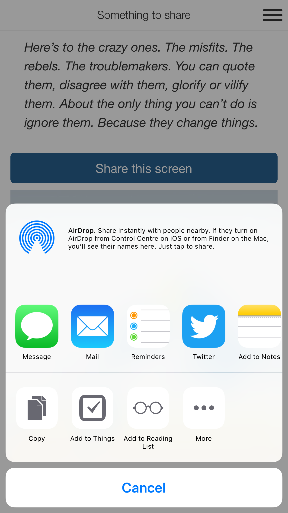

# Communicate JS APIs

The `fliplet-communicate` package contains the namespace `Fliplet.Communicate` and a set of helper methods for sending communications from the app.

- [`.sendEmail()`](#send-an-email) - Sends an HTML formatted email
- [`.sendSMS()`](#send-an-sms) - Sends an SMS message
- [`.composeEmail()`](#compose-an-email) - Composes an email on the device
- [`.shareURL()`](#share-a-url) - Share a URL
- [`.sendPushNotification()`](#send-push-notifications) - Send push notifications

## Send an email

```js
const options = {
  to: [{
    email: "john@example.org",
    name: "John",
    type: "to"
  }],
  html: "<p>Some HTML content</p>",
  subject: "My subject"
};

Fliplet.Communicate.sendEmail(options);
```

---

## Send an SMS

### Default provider
```js
const options = {
  data: {
    to: "+123456789",
    body: "Hey!"
  }
};

Fliplet.Communicate.sendSMS(options);
```

### Twilio

```js
const options = {
  provider: "twilio"
  data: {
    from: "+123456789"
    to: "+123456789",
    body: "Hey!"
  },
  options: {
    twilio_sid: 'AC81caaa94b3b84bb7ba9c3cd96bcb152a', // Your Account SID from www.twilio.com/console
    twilio_auth_token: 'AUTH_TOKEN';                  // Your Auth Token from www.twilio.com/console
  }
};

Fliplet.Communicate.sendSMS(options);
```

Let us know if you require to use another SMS provider and we'll check whether we can integrate it on our system.

---

## Share a URL

### Screenshots

**Native apps**

Native apps will use the operating systems' built-in features to integrate with any other apps installed on the device.

<table>
  <tr>
    <th width="50%">iOS</th>
    <th width="50%">Android</th>
  </tr>
  <tr>
    <td></td>
    <td></td>
  </tr>
</table>

**Web apps**

Web apps will show users a URL to copy and provide icons to share the URL with popular servives.

<table>
  <tr>
    <th width="66.5%">Desktop</th>
    <th width="33.5%">Mobile</th>
  </tr>
  <tr>
    <td></td>
    <td></td>
  </tr>
</table>

### Fliplet.Communicate.shareURL()

(Returns **`Promise`**)

`Fliplet.Communicate.shareURL()` lets users share a URL. The Promise is resolved when the action is completed or dismissed. The share options are passed to the resolving function, with an additional `completed` property to signify if an action was completed or cancelled.

```js
// A simple way to share a URL
Fliplet.Communicate.shareURL('https://maps.google.com/?addr=EC2A+4DN');

// Add an optional message for apps that support the sharing a URL with a message
Fliplet.Communicate.shareURL({
  url: 'https://maps.google.com/?addr=EC2A+4DN',
  message: 'Drop by and say hi!'
});
```

**Recommendation:** Optionally provide a target to enure the share popover appears in the right place on iPads.

```js
Fliplet.Communicate.shareURL({
  url: 'https://maps.google.com/?addr=EC2A+4DN',
  target: '#target'
});
```

[jsSocials](http://js-socials.com/docs/#custom-share) is used in web apps to let users share URLs using the following services:

* Email (`email`)
* LinkedIn (`linkedin`)
* Twitter (`twitter`)
* Facebook (`facebook`)

Optionally provide an array of services in `shares` to use any of the services supported by jsSocials (see **Example** below).

## Examples

### Share a URL

```js
Fliplet.Communicate.shareURL({
  url: 'https://maps.google.com/?addr=EC2A+4DN',
  shares: [
    'email', 'twitter', 'facebook', 'googleplus', 'linkedin',
    'pinterest', 'stumbleupon', 'pocket', 'whatsapp', 'viber',
    'messenger', 'vkontakte', 'telegram', 'line'
  ]
});
```

**Note:** The following services only work on native devices if the app is installed.

* WhatsApp (`whatsapp`)
* Viber (`viber`)
* Facebook Messenger (`messenger`)
* Telegram (`telegram`)

### Share a page in a Fliplet app

See [documentation for `Fliplet.Content`](fliplet-content.md#share-a-page-with-a-url).

---

## Send push notifications

(Returns **`Promise`**)

Available options:

- `title` (required, the title of the notification)
- `body` (required, the message of the notification)
- `sandbox` (optional, when `true`, notifications are only sent to people using Fliplet Viewer. This is useful for testing.)
- `subscription` (optional, an array of **push subscription IDs** to target specific users. These IDs can be found in the "About this app" section of Fliplet apps, accessible via the top menu)
- `badge` (optional, sets the badge on iOS to a specific number)

```js
Fliplet.Communicate.sendPushNotification(appId, {
  title: 'Lorem ipsum',
  body: 'Irure sed ad do dolor ad ut ut anim.'
});
```

**Note**: only app publishers and editors are allowed to send push notifications.

---

[Back to API documentation](../API-Documentation.md)
{: .buttons}
