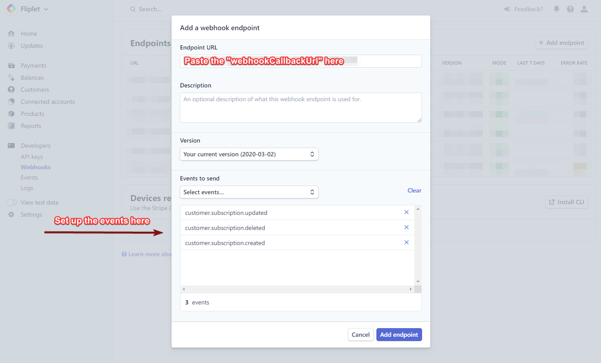
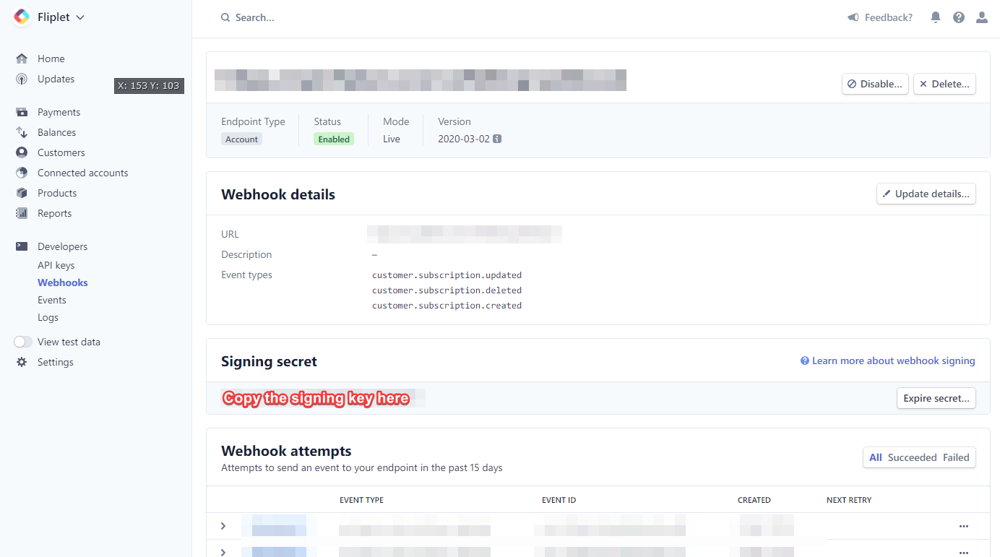

# `Fliplet.Payments`

Adds payments functionality in your apps.

<p class="warning"><strong>Note:</strong> This documentation is a draft subject to change before release.</p>

---

Dependencies: `fliplet-payments`

## Data models and key concepts

Adding payments to your apps has the following four requirements:

1. An app is configured to use payments, including adding the required **settings and secrets** which are securely stored in our backend.
2. You have created a Stripe account and configured the Fliplet webhook URL on their dashboard.
3. A **Data Source** is created with a specific structure to manage the list of products you want the app users to be able to buy.
4. **Custom code** is added in your app screen to let users buy the products and complete the **checkout process** using our simple JS APIs.

---

## Configuration

To start setting up payments for your app, add `fliplet-payments` to your app or screen dependencies.

### 1. Configure the payment settings

An app must first configure its payment settings before users are able to buy products. Configuring the app is done by making a JS API or RESTful API request including the following information:

- `provider`: `string` - the payment provider; we currently only support `stripe` as value
- `providerPublicKey`: `string` - the public key for the Stripe provider
- `providerPrivateKey`: `string` - the private key for the Stripe provider
- `productsDataSourceId`: `number` - the ID of the Data Source listing the products your users can buy

<p class="quote"><strong>Note:</strong> the following request must be made only once and from an authenticated Studio user. <strong>You can however call it at any time to update the configuration</strong>.</p>

```js
// Run this once while logged in as a Studio user
// to set up or update the configuration.
Fliplet.Payments.Configuration.update({
  provider: 'stripe',

  // Get these from https://dashboard.stripe.com/apikeys
  providerPublicKey: 'foo',  // Publisheable key
  providerPrivateKey: 'bar', // Secret key

  productsDataSourceId: 123  // ID of the products data source
}).then(function (result) {
  // Configuration has been set successfully.
  // Your app is almost ready to start checkout sessions.

  console.log('Callback URL to configure in Stripe', result.webhookCallbackUrl);
  // result.webhookCallbackUrl must be configured on your payment provider,
  // see the next section of the docs here below.
});
```

---

### 2. Configure webhooks in the payment provider

Before you start accepting payments, webhooks must be set up in your payment provider to notify Fliplet about charges made from buying products and subscriptions.

The previous JS API (`Fliplet.Payments.Configuration.update`) returns a `webhookCallbackUrl` in its promise callback which you should note down and add into Stripe:

1. Go to the `Developers > Webhooks` section in Stripe: https://dashboard.stripe.com/webhooks
2. Click `Add endpoint`
3. Add the value you got from `webhookCallbackUrl` in the `Endpoint URL` field
4. Choose the following events to be sent:
    - `customer.subscription.updated`
    - `customer.subscription.deleted`
    - `customer.subscription.created`




Save changes to add the endpoint, then copy the value of the `Signing secret`:



Finally, configure your signing secret in the Fliplet app by by running the following JS API as a logged in Studio user:

```js
// Run this once while logged in as a Studio user
// to set up or update the signing secret from Stripe.
Fliplet.Payments.Configuration.updateSigningSecret('whsec_123abc').then(function () {
  // Configuration has been set successfully.
  // Your app is now ready to start checkout sessions.
});
```

Once the webhook has been set up, you can start to configure your data source with the products you want to list.

---

### 3. Configure the products

Use the "App data" section of Fliplet Studio or the Data Sources JS APIs to manage a list of products for users to buy. Each product requires the following information:

- Name: `string`
- Price: `float`
- Price ID: `string` - the ID or hash as found in your payment provider

Here's an example Data Source containing a few products:

| Name         | Description              | Price | Price ID                            |
|--------------|--------------------------|-------|-------------------------------------|
| Premium plan | A fancy premium plan     | 1.00  | price_1HAuW7JNczvHKhMA2lbd8xjs      |
| Gold plan    | A even fancier gold plan | 2.50  | price_2HAuW7sNczvfKhMA2lbd1xjx      |

Once you have set up one or more products you're ready to start accepting payments in your app.

---

### 4. Add code to initiate a checkout session

Our JS APIs allow your apps to read the list of products you have configured and then initiate a checkout process for one of your products.

You want to first read the list of products, then let the user choose one (and its quantity) and then initiate a checkout session.

These are the two JS APIs you need to use to achieve what has been described above:

- `Fliplet.Payments.getProducts()` - fetch the list of products you have configured in the data source
- `Fliplet.Payments.checkout(data)` - initiate a checkout session to let the user buy a product

Here's a full example to help you getting started:

```js
// Get the list of products
Fliplet.Payments.getProducts().then(function (products) {

  // Initiate a checkout session to the payment provider
  Fliplet.Payments.checkout({
    // Options for the payment provider.
    // Refer to the Stripe documentation for the list
    // of available options you can use:
    // https://stripe.com/docs/api/checkout/sessions/create
    line_items: [
      {
        price: products[0]['Price ID'],
        quantity: 1
      },
      {
        price: products[1]['Price ID'],
        quantity: 2
      }
    ],
    mode: 'payment'
  }).then(function onCheckoutCompleted(response) {
    // The checkout session has been completed.
    // The user was successfully charged for the product.

    // response.customerId
    // response.transactionDetails
  }, function onCheckoutFailed(err) {
    // The checkout session has been canceled
    // or could not be completed
  })
})
```

---

## Advanced functionality

### Check if payments have been configured for an app

Use the `isConfigured` method to check whether payments have been configured for the app:

```js
Flipler.Payments.isConfigured().then(function (isConfigured) {
  if (isConfigured) {
    // Payments are configured
  } else {
    // Payments are not configured
  }
});
```

---

### Retrieve the list of payment-related events for a user

Some providers are capable of returning a list of events made for a specific customer, including a list of successfull and failed charges. You can use the following JS API to retrieve a list of all logs generated for a customer:

```js
Fliplet.Payments.Logs.get({
  customerId: 123
}).then(function (logs) {
  // Use logs here
});
```

---

[Back to API documentation](../API-Documentation.md)
{: .buttons}