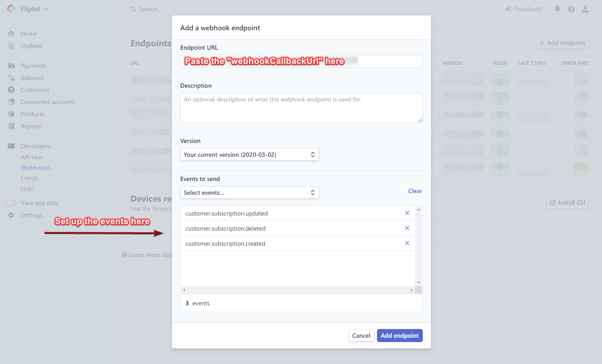
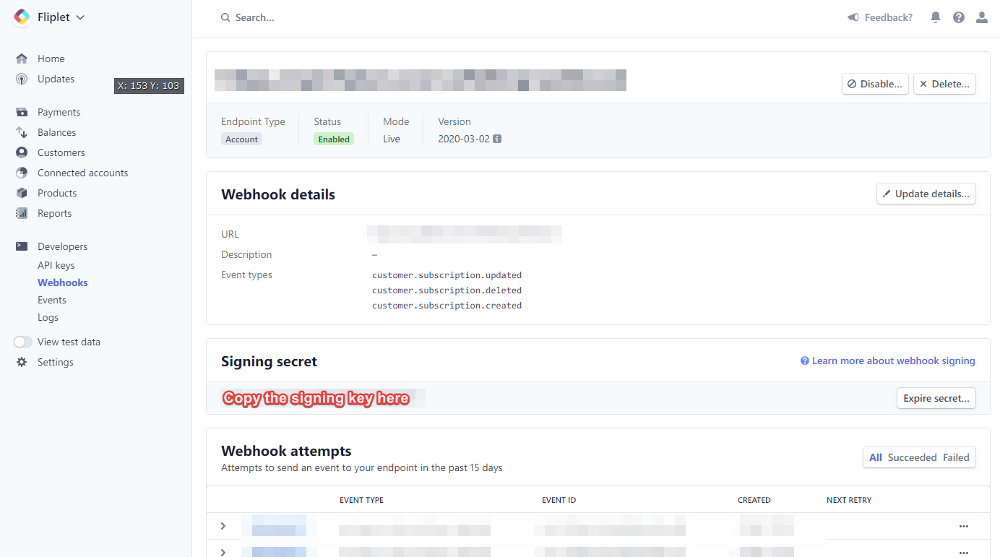

# `Fliplet.Payments`

<section class="sides no-margin">
  <div>
    <p>Accept Stripe payments and checkout in Fliplet apps via <code>Fliplet.Payments</code>, with a products data source and webhook-driven order tracking.</p>
    <p>Before you start, make sure you have signed up for a <a href="https://stripe.com/" target="_blank">Stripe account</a> on their website as it will be required in the very first steps of the integration.</p>
  </div>
  <div>
    <div class="img" style="background-image:url('/assets/img/pay.svg')"></div>
  </div>
</section>

---

Dependency name: `fliplet-payments`

## Data models and key concepts

Adding payments to your apps has the following four requirements:

1. An app is configured to use payments, including adding the required **settings and secrets** which are securely stored in our backend.
2. You have created a Stripe account and configured the Fliplet webhook URL on their dashboard.
3. A **Data Source** is created with a specific structure to manage the list of products you want the app users to be able to buy.
4. **Custom code** is added in your app screen to let users buy the products and complete the **checkout process** using our simple JS APIs.

Optionally, an app can also configure **payment fulfilment** so Fliplet records a
completed payment onto one of your data source rows from the Stripe webhook, rather
than relying on the buyer's browser returning to your app. See
[Recording a payment when the buyer's browser does not come back](#recording-a-payment-when-the-buyers-browser-does-not-come-back).

---

## Configuration

To start setting up payments for your app, add `fliplet-payments` to your app or screen dependencies.

### 1. Configure the payment settings

An app must first configure its payment settings before users are able to buy products. Configuring the app is done by making a JS API or RESTful API request including the following information:

- `provider`: `string` - the payment provider; we currently only support `stripe` as value
- `providerPublicKey`: `string` - the [publisheable key from Stripe](https://dashboard.stripe.com/apikeys)
- `providerPrivateKey`: `string` - the [secret key from Stripe](https://dashboard.stripe.com/apikeys)
- `productsDataSourceId`: `number` - the ID of the Data Source listing the products your users can buy

<p class="quote"><strong>Note:</strong> the following request must be made only once and from an authenticated Studio user. <strong>You can however call it at any time to update the configuration</strong>.</p>

```js
// Run this once while logged in as a Studio user
// to set up or update the configuration.
Fliplet.Payments.Configuration.update({
  provider: 'stripe',

  // Get these from https://dashboard.stripe.com/apikeys
  providerPublicKey: 'pk_live_abcdef123456',  // Publisheable key
  providerPrivateKey: 'sk_live_abcdef123456', // Secret key

  productsDataSourceId: 123  // ID of the products data source
}).then(function (result) {
  // Configuration has been set successfully.
  // Your app is almost ready to start checkout sessions.

  console.log('Webhook URL to configure in Stripe', result.webhookUrl);
  // result.webhookUrl must be configured on your payment provider,
  // see the next section of the docs here below.
  // Here's an example of what the URL looks like:
  // https://api.fliplet.com/v1/billing/webhook/apps/8a85a2edc3f3a774ac06f

});
```

---

### 2. Configure webhooks in the payment provider

Before you start accepting payments, webhooks must be set up in your payment provider to notify Fliplet about charges made from buying products and subscriptions.

The previous JS API (`Fliplet.Payments.Configuration.update`) returns a `webhookUrl` in its promise callback which you should note down and add into Stripe:

1. Go to the [Developers > Webhooks](https://dashboard.stripe.com/webhooks) section in Stripe
2. Click `Add endpoint`
3. Add the value you got from `webhookUrl` in the `Endpoint URL` field. The value has a format similar to this URL: `https://api.fliplet.com/v1/billing/webhook/apps/8a85a2edc3f3a774ac06f`
4. Choose the following events to be sent:
    - `checkout.session.completed`
    - `checkout.session.async_payment_succeeded`
    - `customer.subscription.updated`
    - `customer.subscription.deleted`
    - `customer.subscription.created`

The two `checkout.session` events are what let Fliplet record a completed payment on
its own, without depending on the buyer's browser coming back to your app. Enable both:
`completed` covers the ordinary card path, and `async_payment_succeeded` is the
settlement of a delayed payment method, which can arrive minutes or days later. An
endpoint subscribed only to the `customer.subscription` events will never record a
one-off checkout.




Save changes to add the endpoint, then copy the value of the `Signing secret`:



Finally, configure your signing secret in the Fliplet app by running the following JS API as a logged in Studio user:

```js
// Run this once while logged in as a Studio user
// to set up or update the signing secret from Stripe.
Fliplet.Payments.Configuration.updateSigningSecret('whsec_123abc').then(function () {
  // Configuration has been set successfully.
  // Your app is now ready to start checkout sessions.
});
```

Once the webhook has been set up, you can start to configure your data source with the products you want to list.

---

### 3. Configure the products

Use the "App data" section of Fliplet Studio or the Data Sources JS APIs to manage a list of products for users to buy. Each product requires the following information:

- Name: `string`
- Price: `float`
- Price ID: `string` - the ID or hash as found in your payment provider

Here's an example Data Source containing a few products:

| Name         | Description              | Price | Price ID                            |
|--------------|--------------------------|-------|-------------------------------------|
| Premium plan | A fancy premium plan     | 1.00  | price_1HAuW7JNczvHKhMA2lbd8xjs      |
| Gold plan    | A even fancier gold plan | 2.50  | price_2HAuW7sNczvfKhMA2lbd1xjx      |

Once you have set up one or more products you're ready to start accepting payments in your app.

---

### 4. Add code to initiate a checkout session

Our JS APIs allow your apps to read the list of products you have configured and then initiate a checkout process for one of your products.

You want to first read the list of products, then let the user choose one (and its quantity) and then initiate a checkout session.

These are the two JS APIs you need to use to achieve what has been described above:

- `Fliplet.Payments.Products.get()` - fetch the list of products you have configured in the data source
- `Fliplet.Payments.Checkout.create(options)` - initiate a checkout session to let the user buy a product

Moreover, although not required it is recommended that you use the following JS API to create a customer on Stripe:

- `Fliplet.Payments.Customers.create(options)` - create a customer (if it's existing then it just gets returned)

Here's a full example to help you getting started:

```js
// Get the list of products
Fliplet.Payments.Products.get().then(function (products) {

  // Create or get a customer by email
  return Fliplet.Payments.Customers.create({
    email: 'john@example.org'
  }).then(function(customer) {
    // Save customer.id if required

    // Initiate a checkout session to the payment provider
    return Fliplet.Payments.Checkout.create({
      // Options for the payment provider.
      // Refer to the Stripe documentation for the list
      // of available options you can use:
      // https://stripe.com/docs/api/checkout/sessions/create
      mode: 'payment',
      payment_method_types: ['card'],
      customer: customer.id,

      // Specify the list of items
      // https://stripe.com/docs/api/checkout/sessions/create#create_checkout_session-line_items
      line_items: [
        {
          price: products[0]['Price ID'],
          quantity: 1
        },
        {
          price: products[1]['Price ID'],
          quantity: 2
        }
      ]
    }).then(function onCheckoutCompleted(session) {
      // The checkout session has been completed.
      // The user was successfully charged for the product.
      //
      // Resolves with the checkout session: id, currency, customer,
      // customer_details and customer_email.
      console.log(session.id);
    }, function onCheckoutFailed(err) {
      // The checkout did not complete. See "Telling a failed payment
      // from an unfinished one" below before showing this to a buyer.
    });
  });
});
```

---

## Recording a payment when the buyer's browser does not come back

Everything in the example above runs in the buyer's browser. If that browser closes,
loses its connection, or is put to sleep by the phone before Stripe's confirmation is
handled, the payment succeeds in Stripe while your app never learns about it. The
buyer is charged, their order stays pending, and nothing you can write in the page
fixes it — the code that would react is in the page that has gone away.

Fliplet can record these payments for you from the Stripe webhook instead. Configure
`paymentFulfilment` on the app and Fliplet will mark the row itself when Stripe
confirms the payment.

`paymentFulfilment` is an **app setting**, and it takes this shape:

```js
{
  "paymentFulfilment": {
    "dataSourceId": 123456,
    "statusColumn": "Payment Status",
    "paidValue": "Paid",

    // Optional columns, filled only where the row leaves them blank
    "sessionColumn": "Stripe Session ID",
    "paymentIntentColumn": "Stripe Payment Intent ID",
    "customerColumn": "Stripe Customer ID",

    // Required guards -- a target missing either will not fulfil
    "expectedCurrency": "eur",
    "minimumAmountTotal": 100,

    // Runs the data source's own update hooks for the recorded payment
    "runUpdateHooks": true
  }
}
```

`expectedCurrency` and `minimumAmountTotal` (in the currency's smallest unit) are
mandatory. They ensure a session cannot mark a row paid unless it actually collected
the money you expected, so a cheap or wrong-currency session cannot fulfil an
expensive order.

---

### Setting it on the app

Save it like any other app setting, as a Studio user with edit rights on the app:

```js
// Run once, as a logged in Studio user
Fliplet.App.Settings.set({
  paymentFulfilment: {
    dataSourceId: 123456,
    statusColumn: 'Payment Status',
    paidValue: 'Paid',
    sessionColumn: 'Stripe Session ID',
    paymentIntentColumn: 'Stripe Payment Intent ID',
    customerColumn: 'Stripe Customer ID',
    expectedCurrency: 'eur',
    minimumAmountTotal: 100,
    runUpdateHooks: true
  }
}).then(function () {
  // Saved. The next completed checkout will be recorded.
});
```

or over the RESTful API:

```
POST v1/apps/:appId/settings
```

```json
{ "paymentFulfilment": { "dataSourceId": 123456, "statusColumn": "Payment Status", "paidValue": "Paid" } }
```

Both merge into the app's existing settings rather than replacing them, so other
settings are left alone.

Three things decide whether the value you save is the one that takes effect:

**It must be the master app.** The endpoint rejects a published app, so run this
against the app you edit in Studio.

**Do not run it from Studio preview or Fliplet Viewer.** When
`Fliplet.Env.get('development') === true`, `Fliplet.App.Settings.set()` skips the
network call and mutates `window.ENV.appSettings` in memory — the promise resolves,
nothing is saved, and it looks like it worked. Run it on the live app, or use the
RESTful API.

**Republish after changing it.** A published app carries its own copy of the setting,
and that copy takes precedence over the master's. Editing the master without
republishing leaves the published app serving the older value.

To check what an app is really using, read it back with
`Fliplet.App.Settings.get('paymentFulfilment')` on the app you are testing.

Which row gets marked is taken from `client_reference_id` on the checkout session, so
your checkout call must set it:

```js
Fliplet.Payments.Checkout.create({
  mode: 'payment',
  line_items: lineItems,
  client_reference_id: entryId.toString()
});
```

---

### Proving the buyer owns the row

`client_reference_id` arrives from the browser, and entry IDs are sequential and
guessable. Fliplet therefore checks, before creating the session, that the caller is
entitled to the row they named — otherwise a buyer could pay against someone else's
order and have it fulfilled on their behalf.

The check passes in either of two ways.

**By the data source's access rules.** If your buyers sign in to the app, and the
rules allow that user to update their own row, nothing further is needed.

**By a per-row token.** Apps whose buyers have no account cannot satisfy any rule —
with no identity there is nothing for `loggedIn` or a user rule to match. For those
apps, name a column holding a per-row secret the buyer already has, such as a
registration UUID or order reference:

```js
{
  "paymentFulfilment": {
    // ...
    "ownershipTokenColumn": "Registration Unique ID"
  }
}
```

and present that value when creating the session:

```js
Fliplet.Payments.Checkout.create({
  mode: 'payment',
  line_items: lineItems,
  client_reference_id: entryId.toString(),
  flPurchaseToken: registrationUniqueId
});
```

The stored value must be at least 16 characters — a short or blank column authorises
nothing, or every row with an empty token would be claimable. `flPurchaseToken` is
removed from the payload before it is forwarded to Stripe, so the secret is never
handed to a third party. A `Fl-Purchase-Token` request header is accepted too, for
callers that can set one.

If neither route succeeds the checkout is refused with a `403`, and the buyer is never
sent to Stripe.

> **Enabling `paymentFulfilment` on an existing app turns this check on for the first
> time.** If your app has an `ownershipTokenColumn` but its screens do not yet send
> `flPurchaseToken`, and its access rules do not grant the buyer an update, every
> checkout will start failing. Ship the token first, then enable fulfilment.

---

### Telling a failed payment from an unfinished one

When a checkout does not complete, the rejection carries one of two reasons, and they
mean different things:

- `app.payments.error.paymentIncomplete` — Stripe told us this checkout ended without
  a payment. A verdict.
- `app.payments.error.paymentPending` — we stopped watching before Stripe committed
  either way. The absence of a verdict; the payment may still succeed.

Treat them differently. Telling a buyer their card was not charged while the charge is
still in flight is how a second charge happens. On `paymentPending`, tell the buyer the
payment is still being confirmed and that they should not pay again — if the payment
does go through, the webhook records it.

Note also that a blocked pop-up surfaces as `paymentIncomplete`, because no Stripe page
ever opened. If buyers report this without having seen a payment form, check the
browser's pop-up blocker before looking at the payment itself.

---

## Advanced functionality

### Check if payments have been configured for an app

Use the `Configuration.exists()` method to check whether payments have been configured for the app:

```js
Fliplet.Payments.Configuration.exists().then(function (isConfigured) {
  if (isConfigured) {
    // Payments are configured
  } else {
    // Payments are not configured
  }
});
```

---

## Customers and events

### Create a customer

Use the following JS API to create a customer, or return the existing record when it already exists for the given email:

```js
return Fliplet.Payments.Customers.create({
  email: 'nvalbusa@fliplet.com'
}).then(function(customer) {
  // Use customer as required
  console.log(customer);
});
```

---

### Retrieve the list of payment-related events for a customer

Some providers are capable of returning a list of events made for a specific customer, including a list of successfull and failed charges. You can use the following JS API to retrieve a list of all logs generated for a customer:

```js
Fliplet.Payments.Customers.getLogs({
  customer: 'cus_abcdefg123456'
}).then(function (logs) {
  // Use logs here
});
```

This is the full list of supported input parameters:

- `customer` (String)
- `limit` (Number, defaults to 100)
- `offset` (Number, defaults to 0)
- `where` (Query object)

```js
return Fliplet.Payments.Customers.getLogs({
  customer: 'cus_abcdefg123456',
  limit: 30,
  offset: 0,
  where: {
    type: 'payment_intent.created'
  }
}).then(function (logs) {

});
```

---

### Open the customer billing portal on Stripe

Use the `openBillingPortal` JS API to redirect the user to the customer billing portal on Stripe. The promise will resolve once the user has returned to the app.

```js
Fliplet.Payments.Customers.openBillingPortal({
  customer: 'cus_abcdefg123456'
});
```

---

[Back to API documentation](../API-Documentation)
{: .buttons}