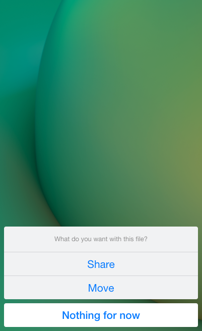
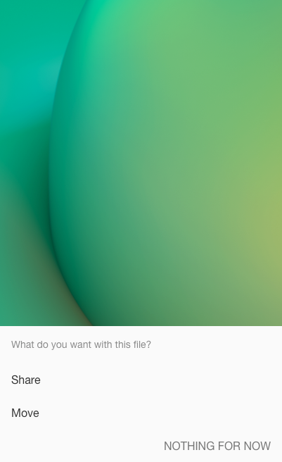

# `Fliplet.UI.Actions()`

Show a native-style action sheet with a title, a list of labeled options, and an optional cancel button via `Fliplet.UI.Actions()`. The returned Promise resolves with the 0-based index of the chosen label once its action runs, or with `undefined` if the user cancels.

## Screenshots

<table>
  <tr>
    <th width="50%">iOS and desktop</th>
    <th width="50%">Android</th>
  </tr>
  <tr>
    <td></td>
    <td></td>
  </tr>
</table>

## Usage

```js
Fliplet.UI.Actions(options)
```

  - **options** (Object) A map of options to pass to the constructor.
    - **title** (String) A title that appears above the options.
    - **labels** (Array) Options to show the user. Each label object contains the following properties:
      - **label** (String) Option label to show the user.
      - **action** (Object or Function)
        - (Object) If the object contains a `type` key with a value of `copyText`, the value for `text` will be copied to the clipboard. Otherwise, the object will be passed to `Fliplet.Navigate.to()` and executed accordingly.
        - (Function) If a function is provided, the function will be run with the 0-based index of the label as the first parameter.
    - **cancel** (Boolean or String) Unless this is `false` or an empty string, a cancel button will be added at the bottom with the provided string used as the button label. (**Default**: `Cancel`)

## Properties

The toast instance returned in the promise resolving function will contain the following properties.

  - **data** (Object) A data object containing the configuration fro the Toast notification.

## Examples

### Open an address in Google Maps or share the address

```js
var mapUrl = 'https://maps.google.com/?addr=N1+9PF';
Fliplet.UI.Actions({
  title: 'What do you want with this address?',
  labels: [
    {
      label: 'Open in Google Maps',
      action: {
        action: 'url',
        url: mapUrl
      }
    },
    {
      label: 'Share URL',
      action: function (i) {
        // i will be 1
        Fliplet.Communicate.shareURL(mapUrl);
      }
    }
  ],
  cancel: 'Dismiss'
}).then(function(i){
  // i will be 0 or 1 depending on users's choice
  // ...or undefined if user chooses chooses "Dismiss"
});
```

### Copy a Google Maps address

```js
var mapUrl = 'https://maps.google.com/?addr=N1+9PF';
Fliplet.UI.Actions({
  title: 'What do you want with this address?',
  labels: [
    {
      label: 'Copy address',
      action: {
        type: 'copyText',
        text: mapUrl
      }
    }
  ],
  cancel: 'Dismiss'
});
```

---

[Back to Fliplet.UI](./fliplet-ui.md)
{: .buttons}
