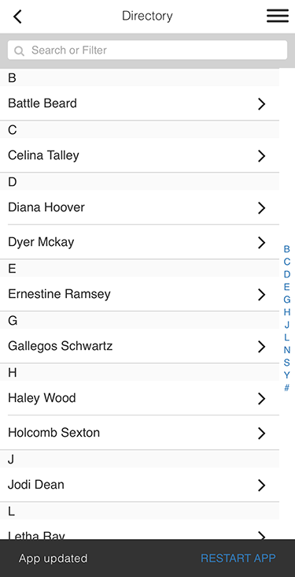
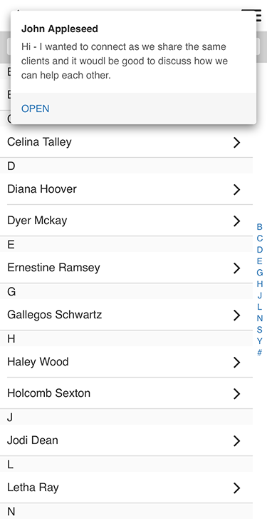

# `Fliplet.UI.Toast()`

(Returns **`Promise`**)

Create a non-obtrusive dialog that disappears after a few seconds (unless configured otherwise). This provides a simple mechanism to provide feedback about an operation while allowing users to continue using the app.

There are 2 different types of Toast notifications, **minimal** and **regular**.

<table>
  <tr>
    <th width="50%">Minimal Toast Notification</th>
    <th width="50%">Regular Toast Notification</th>
  </tr>
  <tr>
    <td>
      <p>A <strong>minimal</strong> toast notification provides brief feedback about an operation with the least amount of interruption to the user.</p>
      <p><strong>Minimal</strong> toast notifications are usually displayed at the bottom of the screen.</p>
    </td>
    <td>
      <p>A <strong>regular</strong> toast notification occupies more substantial space and is styled to attract more attention from the user. This can be used to provide timely and relevant information about your app and current operation.</p>
      <p><strong>Regular</strong> toast notifications are usually displayed at the top of the screen.</p>
    </td>
  </tr>
  <tr>
    <td></td>
    <td></td>
  </tr>
</table>

## Usage

```js
Fliplet.UI.Toast(message)
```

* **message** (String) Content to be displayed in the Toast notification. This generates a `minimal` Toast notifications, and the content be truncated to 2 lines.

```js
Fliplet.UI.Toast(options)
```

* **options** (Object) A map of options to pass to the constructor.
  * **type** (String) (`minimal` or `regular`) Use this to determine the type of Toast notification to generate. (**Default**: `minimal`)
  * **position** (String) (`top`, `center` or `bottom`) Use this to configure the placement of the Toast notification. By default, `minimal` Toast notifications are displayed at the `bottom` and `regular` Toast notifications are displayed at the `top`. Toast UIs positioned in the center are automatically resized to the size of the content instead of a set width.
  * **backdrop** (Boolean) If `true`, an 60% opaque black backdrop will be added behind the Toast UI. Clicking/tapping on the backdrop will close the Toast UI unless `tapToDismiss` is set to `false`. (**Default**: `false`)
  * **tapToDismiss** (Boolean) If `true`, the Toast UI and overlay (if applicable) will be dismissed when user clicks/taps on the Toast UI and overlay. (**Default**: `true`)
  * **duration** (String, Number or Boolean) (`short`, `long`, `none` or `false`) Pass a number to determine how long (in milliseconds) the Toast notification will be on screen before it is automatically dismissed. If the string `none` or boolean value `false` is passed, the Toast notification will remain visible until `.dismiss()` is called to dismiss the notification. The keywrods `short` and `long` can also be used to set the duration to `2000` and `4000` milliseconds respectiverly. (**Default**: `4000`)
  * **title** (String) The `regular` Toast notification design allows an optional title to be included.
  * **message** (String) Content to be displayed in the Toast notification. `regular` Toast notifications will truncate this to 3 lines. `minimal` Toast notifications will truncate this to 2 lines.
  * **progress** (Boolean) If `true`, a progress bar will be included. The progress bar can be controlled with the `.setProgress()` method. If the progress bar is included, the Toast notification will not be dismissed automatically.
  * **html** (String) Use this to set a custom content to the Toast notification. If `html` is set, `title` and `message` will be ignored.
  * **actions** (Array) An array of call-to-actions to include in the Toast notification. Each call-to-action is configured through an object with the following properties:
    * **label** (String) Label text for the call-to-action.
    * **action** (Object or Function) If an object is passed, the object will be passed to `Fliplet.Navigate.to()` when user interacts with the call-to-action. If a function is passed, the function will be executed with the index passed as the first parameter and the `this` variable will contain the original object passed to the `Fliplet.UI.Toast()` constructor. **Note** Executing an action will automatically dimiss the Toast notification, unless the callback function returns `false`.

## Properties

The toast instance returned in the promise resolving function will contain the following properties.

* **data** (Object) A data object containing the configuration fro the Toast notification.

## Methods

The toast instance returned in the promise resolving function will contain the following methods.

### `.dismiss()`

(Returns **Promise**)

Dismisses the Toast notification. The promise is fulfilled when the Toast notification is removed from the page.

```js
.dismiss();
```

### `.open()`

(Returns **Promise**)

Opens the Toast notification by executing one of the call-to-actions. The promise is fulfilled when the Toast notification is removed from the page.

```js
.open(index)
```

* **index** (Number) A 0-based index referencing the call-to-action to execute. If an `index` is not provided or is invalid, no actions will be executed.

### `.setProgress()`

(Returns **Promise**)

If a progress bar is present, sets the progress bar to the given progress. The promise is fulfilled when the progress bar has stopped transitioning to the new progress point.

```js
.setProgress(percent)
```

* **percent** (Number) A number between 0 and 1 that is used to set the progress bar, where 1 implies a 100% progress.

## Examples

### Display a minimal Toast notification

```js
Fliplet.UI.Toast('App updated');
```

### Use a Toast notification to show error messages

```js
// Data Source 0 is not found, and will trigger an error
Fliplet.DataSources.connect(0)
  .then(funciton (connection) {
    return connection.find();
  })
  .catch(function (error) {
    console.error(error);
    Fliplet.UI.Toast({
      message: 'Error loading data',
      actions: [
        {
          label: 'Details',
          action: function () {
            Fliplet.UI.Toast({
              html: error.message || error
            });
          }
        }
      ]
    });
  });
```

### Displays a regular Toast notification, then a minimal Toast notification

```js
Fliplet.UI.Toast({
  type: 'regular',
  title: 'John Appleseed',
  message: 'Here’s to the crazy ones. The misfits. The rebels. The troublemakers. You can quote them, disagree with them, glorify or vilify them. About the only thing you can’t do is ignore them. Because they change things.',
  actions: [
    {
      label: 'Who said this?',
      action: function () {
        var title = this.data.title;
        Fliplet.UI.Toast(title); // Initiating a new Toast notification will automatically dismiss all existing Toast notifications
        return false;
      }
    }
  ]
})
```

---

[Back to Fliplet.UI](./fliplet-ui.md)
{: .buttons}
