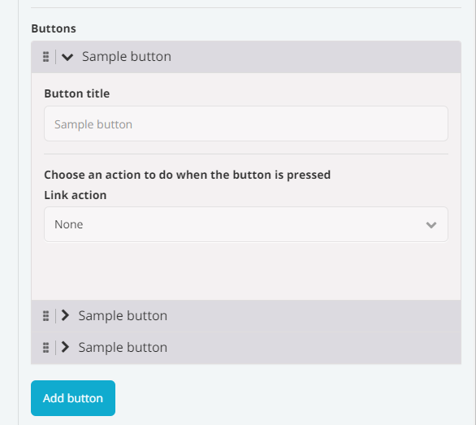

# Fields

Specify a list of fields to be displayed to the user in Fliplet Studio. The fields are displayed in the order as defined.
## Properties for all fields

The following property can be defined for all field types (except when specified otherwise):

- `type` (String, required) Type of field. See [Types](#types) below
- `name` (String, required) Name of the field as referenced by the JS API
- `label` (String) A bold label displayed before the input field in the configuration UI
- `description` (String) A description displayed after the input field
- `default` (*) A default value, if the value is undefined
- `warning` (String) A warning label to be displayed to the user below the input
- `ready` (Function) A function to run when a field is initialized (see [Hooks & Events](interface-hooks.html#run-a-function-when-a-field-is-initialized))
- `change` (Function) A function to run when a field value changes (see [Hooks & Events](interface-hooks.html#run-a-function-when-a-field-value-changes))
- `required` (Boolean) If `TRUE`, the field is required. `required` is not supported by the field types `hidden`, `html` and `provider`.
- `rules` (Object) Use an object expression to apply additional validation rules. See <a href="https://vee-validate.logaretm.com/v3/advanced/rules-object-expression.html#defining-rules" target="_blank">Rules Object Expression</a>.
- `validation` (Function(`value`)) Use a custom function to validate field `value`. If `value` is valid, return `TRUE`. Otherwise, return a string for the validation message.

## Types

* Text input (`text`)
* Email (`email`)
* Textarea (`textarea`)
* Checkbox (`checkbox`)
* Radio (`radio`)
* Dropdown (`dropdown`)
* Toggle (`toggle`)
* Hidden (`hidden`)
* Horizontal rule (`hr`)
* Provider (`provider`)
* HTML (`html`)
* List of fields (`list`)

### Text input (`text`)

A simple text input field. Also supports the following optional properties:

- `placeholder` (String) Placeholder text before user provides a value

Example:

```js
{
  type: 'text',
  name: 'firstName',
  label: 'First Name',
  description: 'The first name of the user',
  placeholder: 'Type your name',
  required: true
}
```

---

### Email (`email`)

An email input field. The text is validated to ensure it's an email address. Also supports the following optional properties:

- `placeholder` (String) Placeholder text before user provides a value

Example:

```js
{
  type: 'email',
  name: 'email',
  label: 'Email address',
  description: 'Emails will be sent to this address',
  placeholder: 'Type your email address',
  required: true
}
```

---

### Textarea (`textarea`)

A simple textarea input field. Also supports the following optional properties:

- `placeholder` (String) Placeholder text before user provides a value
- `rows` (Number) Size of the textarea box, in number of lines of text

Example:

```js
{
  type: 'textarea',
  name: 'bio',
  label: 'Bio',
  description: 'Type your bio',
  required: true,
  rows: 5
}
```

---

### Checkbox (`checkbox`)

A list of checkboxes for the user to allow a multiple choice selection. The value is always saved and accessed as an array. For a single checkbox, see the [Toggle](#toggle) field type Supports the following property:

- `options` (Array[*]) List of values. Each value can be a string or an object
  - (String) Use a string to use the same value as the label
  - (Object`{ value, label }`) Use an object to set different labels that are different from the value. If a `value` is provided without `label`, `label` will match the `value`.

Example:

```js
{
  type: 'checkbox',
  name: 'fruits',
  label: 'Choose one or more fruits',
  options: ['Apple', 'Orange']
}
```

Example with different label and value:

```js
{
  type: 'checkbox',
  name: 'fruits',
  label: 'What stocks do you like?',
  options: [
    { value: 'AAPL', label: 'Apple' },
    { value: 'GOOGL', label: 'Google' }
  ]
}
```

---

### Radio (`radio`)

A list of radio buttons for the user to allow a single choice selection. Supports the following properties:

- `options` (Array[*]) List of values. Each value can be a string or an object
  - (String) Use a string to use the same value as the label
  - (Object`{ value, label }`) Use an object to set different labels that are different from the value. If a `value` is provided without `label`, `label` will match the `value`.

Example:

```js
{
  type: 'radio',
  name: 'fruits',
  label: 'Choose a fruit',
  options: ['Apple', 'Orange']
}
```

Example with different label and value:

```js
{
  type: 'radio',
  name: 'stocks',
  label: 'Which stock do you like most?',
  options: [
    { value: 'AAPL', label: 'Apple' },
    { value: 'GOOGL', label: 'Google' }
  ]
}
```

---

### Dropdown (`dropdown`)

A dropdown for the user to allow a single choice selection. Supports the following properties:

- `options` (Array[*]) List of values. Each value can be a string or an object
  - (String) Use a string to use the same value as the label
  - (Object `{ value, label }`) Use an object to set different labels that are different from the value. If a `value` is provided without `label`, `label` will match the `value`.
- `placeholder` (String|Boolean) Defines a custom placeholder for an empty selection. Use `FALSE` to have no placeholder. The default value is `-- Select an option`. If `required` is set to `TRUE`, the placeholder will be displayed, but the user will not be able to select it as a valid option. If there's an option with an empty string as its value (i.e., `value: ''`), the `placeholder` property will be ignored.

Example:

```js
{
  type: 'dropdown',
  name: 'continent',
  label: 'Choose a continent',
  options: [
    'Africa',
    'Antarctica',
    'Asia',
    'Australia',
    'Europe',
    { value: 'North America', label: 'N. America' },
    { value: 'South America', label: 'S. America' }
  ]
}
```

---

### Toggle (`toggle`)

A checkbox for users to enable/disable or turn on/off a value. Unlike the `checkbox` type, the saved value will be in Boolean (`TRUE`/`FALSE`). Supports the following properties:

- `toggleLabel` (String) Label next to the checkbox

```js
{
  type: 'toggle',
  name: 'darkMode',
  label: 'Turn on Dark Mode',
  description: 'Enable Dark Mode',
  toggleLabel: 'Enable',
  default: true
}
```

---

### Hidden (`hidden`)

Use a hidden field to save a value without showing an input to the user. This could be useful for templating. Note that hidden fields are not validated.

```js
{
  name: 'showNavBar',
  type: 'hidden'
}
```

---

### Horizontal rule (`hr`)

The `hr` type field is used to insert a horizontal rule (line) in the form. It can be used to visually separate different sections of the form for better readability. It does not hold any value or interact with the user input.

```js
{
  type: 'hr'
}
```

---

### Provider (`provider`)

A provider (Fliplet first-party component) to perform a variety of tasks. These are commonly used to reuse existing functionality, e.g. let the user choose a screen or a data source.

- `package` (String) Name of the package e.g. `com.fliplet.link`)
- `ready` (Function) Provider interface has been presented to the user
- `onEvent` (Function) Listen for events fired from the provider
- `beforeSave` (Function) Function to modify the data returned by the provider before it is saved. Similar to a middleware that intercepts the data for last-minute changes.
- `data` (Function) Function to adjust the data already saved in the instance before it is passed to the provider. Useful for transforming the data into a format expected by the provider.
- `mode` (String) If set to `full-screen`, the provider will be loaded to cover the entire configuration interface
- `html` (String) When used in `full-screen` mode, this is the Handlebars template for defining a placeholder to launch the provider. Add an `data-open-provider` attribute to the element that would be used to open the provider. The available variables for the Handlebars context are:
  - `value` (*) Value of the field

Supported inline provider packages:

- [Link Action Provider `com.fliplet.link`](https://github.com/Fliplet/fliplet-widget-link) - Choose an action to be performed
- [Data Source Provider `com.fliplet.data-source-provider`](https://github.com/Fliplet/fliplet-widget-data-source-provider) - Choose a data source

Example for an inline provider:

```js
{
  type: 'provider',
  name: 'action',
  label: 'Choose an action to do when the button is pressed',
  package: 'com.fliplet.data-source-provider',
  beforeSave: function(value) {
    // Modify the data before it's saved
    // For example, only save the ID of an object
    return value && value.id;
  },
  data: function(value) {
    // Adjust the saved data before it's passed to the provider
    // For example, adding metadata useful only for the provider interface
    return {
      dataSourceTitle: 'Your list data',
      dataSourceId: value,
      appId: Fliplet.Env.get('appId'),
      default: {
        name: 'Your list data',
        entries: [],
        columns: []
      },
      accessRules: []
    };
  },
  ready: function(el, value, provider) {
    // Link provider is rendered
  },
  onEvent: function(eventName, data) {
    // Listen for events fired from the provider
  }
}
```

Supported `full-screen` provider packages:

- [File Picker `com.fliplet.file-picker`](https://github.com/Fliplet/fliplet-widget-file-picker) - Choose one or multiple files and folders
- [Email Provider `com.fliplet.email-provider`](https://github.com/Fliplet/fliplet-widget-email-provider) - Configure an email

Example for a `full-screen` provider:

```js
{
  type: 'provider',
  name: 'files',
  label: 'Choose a file',
  package: 'com.fliplet.file-picker',
  mode: 'full-screen',
  html: '<button data-open-provider>Configure</button> You selected {{ value.length }} files'
}
```

As shown in the example above, the `html` requires a trigger element to open the provider. You can define the trigger by adding the `data-open-provider` data attribute to any HTML element defined in the Handlebars template.

---

### HTML (`html`)

A freeform HTML field. Supports the following properties:

- `html` (String) the HTML template
- `ready` (Function) a function to run when a field is initialized (see [Hooks & Events](interface-hooks.html#run-a-function-when-a-field-is-initialized))

```js
{
  type: 'html',
  html: '<input type="email" name="Email" />'
}
```

---

### List of fields (`list`)

An array of fields for the user to allow setting up complex lists. Each item in the list is displayed as an accordion with the list of fields configured in your list. Here's an example of what it looks like:



A list of fields supports the following property:

- `addLabel` (String) the label displayed in the UI to add a new item
- `headingFieldName` (String) the name of the field that should display its value in the accordion header
- `emptyListPlaceholderHtml` (String) optional HTML to display when the list is empty
- `fields` (**Array** of field objects) the array of fields to display for the user to configure for each item in the list

Example:

```js
{
  name: 'buttons',
  label: 'Buttons',
  type: 'list',
  addLabel: 'Add button',
  headingFieldName: 'title',
  emptyListPlaceholderHtml: '<p>Please add at least one button</p>',
  fields: [
    {
      name: 'title',
      type: 'text',
      label: 'Button title',
      placeholder: 'Sample button'
    },
    {
      type: 'provider',
      name: 'action',
      label: 'Choose what happens when the button is pressed',
      package: 'com.fliplet.link'
    }
  ]
}
```

---

## Further reading

<section class="blocks alt">
  <a class="bl two" href="interface-hooks.html">
    <div>
      <span class="pin">Recommended reading</span>
      <h4>Hooks &amp; Events</h4>
      <p>Learn the different hooks and events for helper interfaces.</p>
      <button>Read &rarr;</button>
    </div>
  </a>
</section>
