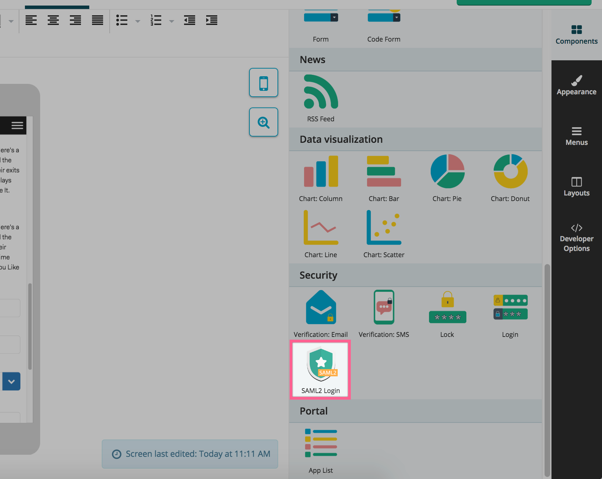
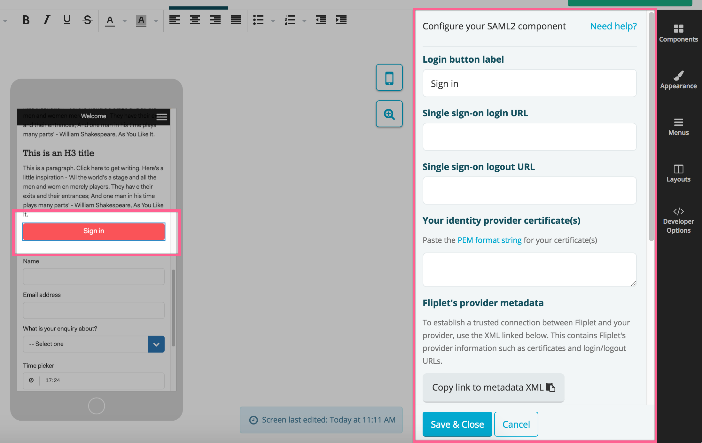
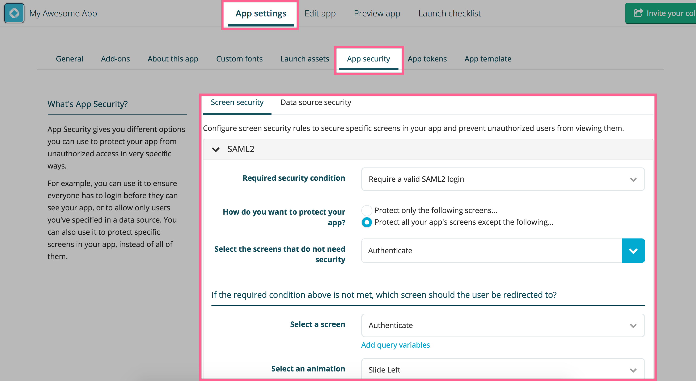
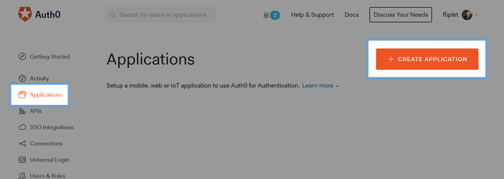
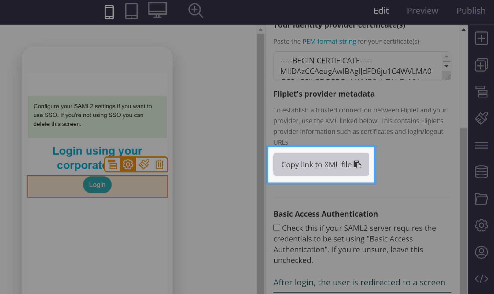
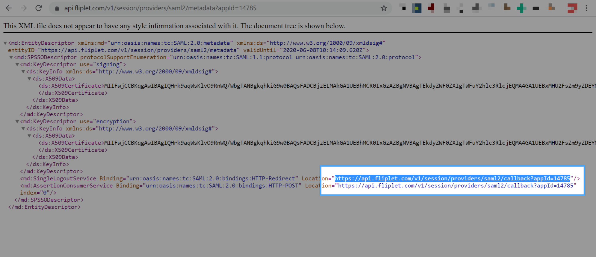
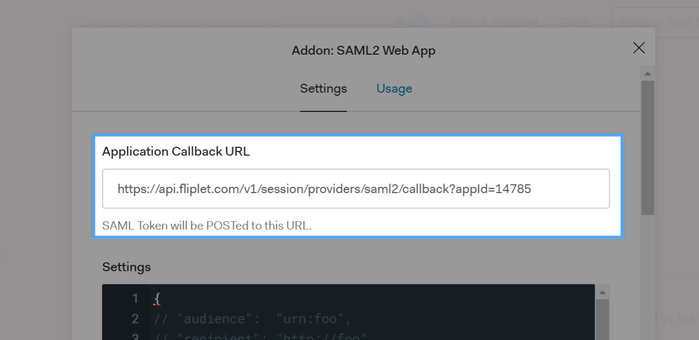
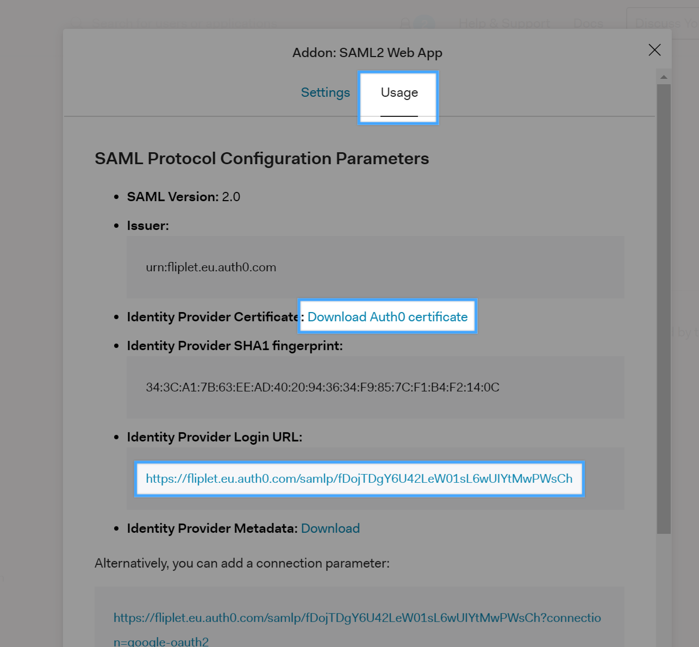
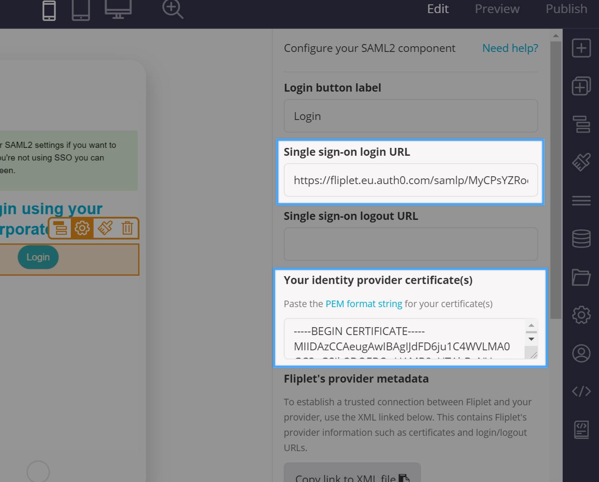

# Single Sign-on with SAML2

Fliplet offers **secure Single Sign-On (SSO)** to your apps through the **SAML2** standard. Setting it up usually requires IT/backend support from your system administrators for the initial configuration phase only.

## Getting started

Create a new Fliplet app or use your existing one then drop the **SAML2 component** into your screen:



Once you've dropped the component in your screen, a "Sign in" button will appear along with the configuration interface on the right hand side:



The first thing you'll need is to **press the copy the link to the metadata XML** button on the bottom right of the screen. That will copy on your computer clipboard a URL to the metadata file which you will need to provide to your IT. Its format is the following:

```
https://api.fliplet.com/v1/session/providers/saml2/metadata?appId=123
```

Please note that the `appId=123` will change depending on your Fliplet app id. If your system does not allow importing the above XML, you can still configure the integration by manually getting the fields to use from the XML. These are the ones you will need and how to find them:

1. **Entity ID** (or Identifier) this field has a fixed value and it's `https://api.fliplet.com/v1/session/providers/saml2/metadata` for any Fliplet app
2. **Reply URL** (or Assertion URL) is dynamic and depends on your Flipler App ID. Here's a sample value for it: `https://api.fliplet.com/v1/session/providers/saml2/callback?appId=123`
2. Service Provider Certificate (PEM String format): [Download](../../assets/misc/saml2-certificate.txt)

Note: the three fields above can also be retrieved from the metadata XML under the following paths: `SingleSignOnService`, `SingleLogoutService`, `X509Certificate`.

Once you have given the above to your IT, they should be able to configure the integration and come back to you with a few details which you will need to paste back on the Fliplet SAML2 component configuration interface:

- **Single sign-on login** URL
- **Single sign-on logout** URL
- Your Identity Provider **Certificate(s)** in PEM format

When everything is set up, clicking the sign in button on the Fliplet app should redirect the user to your login screen. Once a login succeed, the user will be redirected back to the Fliplet app at the screen you selected in the component configuration.

### Exposing data

Your IT might ask you what data should be exposed to the Fliplet app with the integration. We usually recommend our clients to expose the following properties of the **user** object:

- `email`
- `given_name`
- `surname`

These can be used to enhance your Fliplet app user experience by displaying them on your app screens once the user has logged in. This is described further below on this document.

### Adding more security to your app

Once the integration is all working, you can secure your app by requiring a valid SAML2 session to all screens except the login one. This only takes a few seconds via the **App security** tab of your app settings:



---

## The integration flow explained

1. User clicks a login button on a Fliplet app and gets redirected to the client's login page.
2. User logs in with his/her organisation credentials (not Fliplet credentials) and gets redirected back to Fliplet servers.
3. Fliplet servers validate the login request and redirects the user back to the Fliplet app and to the relevant page.

---

## Access SAML2 data into your apps

Once your app has been set up with a *SAML2* Single Sign-on login, you can access the logged user details using the following JS API:

```js
Fliplet.User.getCachedSession().then(function (session) {
  var user = _.get(session, 'entries.saml2.user');

  if (!user) {
    return; // user is not logged in with saml2
  }

  // user contains "firstName", "lastName" and "email"

  // create a welcome string
  var text = `Hi ${user.firstName}. You are signed in as ${user.email}.`;

  // display it in a html element with class "welcome"
  $('.welcome').text(text);
});
```

---

## Set up a test SAML2 integration with Auth0

While developing your app it may be useful to have a sample test account for SAML2 so you can fully test your integration and any custom code requiring SAML2 data. We do recommend using [Auth0](https://auth0.com) as the setup is quite simple and only requires a free account.

Create a free account on **Auth0**, then go to the **Applications** tab and **create a new application**:



Type a name for your application and choose **Regular web applications** for the application type. Click on the **Add-ons** tab and then enable the **SAML2 Web app** add-on.

You will now need to get the **Application Callback URL** from your Fliplet app. Open Fliplet Studio, copy the URL to the Provider metadata and open it in a new tab as shown below:



Once the URL has opened and a XML is shown on the browser, you will need to copy the callback URL and paste it to the Auth0 configuration interface:





Click on the **Usage** tab, **download the Auth0 certificate** and **copy the Identity Provider Login URL**:



You will need to open the Auth0 certificate with a text editor, copy the file contents and paste it to the SAML2 configuration interface in Fliplet Studio in the **Your identity provider certificate(s)** textarea. The Identity provider login URL must also be pasted in the **Single sign-on login URL**:



Finally, click on the **Settings** tab of the Auth0 interface, then scroll to the bottom of the modal window and click the blue **Enable** button, then close the modal window.

Save the interface settings for SAML2 in Fliplet Studio by clicking **Save & Close**, then preview your app to initiate the SAML2 Single-Sign-On.

By default, Auth0 is configured to allow users to log in using their Google account, which makes testing ever easier since you don't have to configure additional users tables in Auth0 if you have a google account.

---

## Third-party reference docs

The following links might help you and your IT to configure the integration. Please use the link depending on the backend system you use:

- [Configuring SAML2 on Azure Active Directory](https://docs.microsoft.com/en-us/azure/active-directory/active-directory-saas-custom-apps)
- [Configuring SAML2 on ADFS 2.0](https://www.replicon.com/help/configuring-adfs-20-to-work-with-saml-20)
- [Configuring SAML2 on Salesforce](https://help.salesforce.com/articleView?id=sso_saml.htm&type=5)

---

[Back to API documentation](../../API-Documentation.md)
{: .buttons}