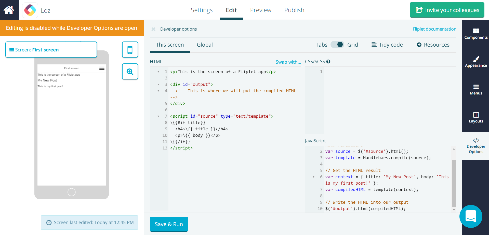

# Using Handlebars in your apps

All screens of your Fliplet app already include [Handlebars](https://handlebarsjs.com/) hence you can start using it straight away. Here's a quick example following the official Handlebars docs:

```js
// Compile a template in JavaScript by using Handlebars.compile
var source = '<h1>{{ title }}</h1><p>{{ body }}</p>';
var template = Handlebars.compile(source);

// Get the HTML result of evaluating a Handlebars template by executing the template with a context.
var context = { title: 'My New Post', body: 'This is my first post!' };
var html = template(context);
```

For clarity, you can include your source templates in the screen's HTML so they're easier to write. If you do so, you must escape all Handlebars commands with a backslash since the screen HTML is also compiled by Handlebars by Fliplet:


```handlebars
<p>This is the screen of a Fliplet app</p>

<div id="output">
  <!-- This is where we will put the compiled HTML -->
</div>

<script id="source" type="text/template">
\{{#if title}}
  <h4>\{{ title }}</h4>
  <p>\{{ body }}</p>
\{{/if}}
</script>
```


```js
// Grab the template from the HTML and compile it with Handlebars
var source = $('#source').html();
var template = Handlebars.compile(source);

// Get the HTML result
var context = { title: 'My New Post', body: 'This is my first post!' };
var compiledHTML = template(context);

// Write the HTML into our output
$('#output').html(compiledHTML);
```



---

