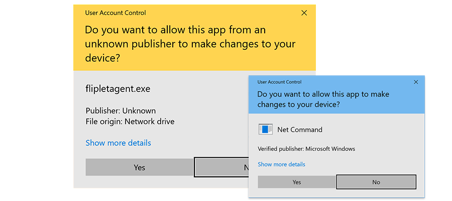
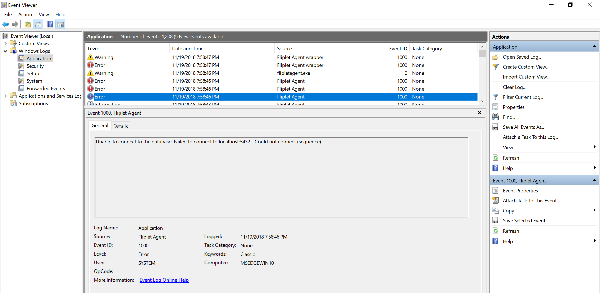

# Data integration service

**Fliplet Agent (Data integration service)** is a command line utility to synchronize data to and from Fliplet Servers.

[](https://github.com/Fliplet/fliplet-agent)

---

## Before you start

To synchronize your data with Fliplet servers you will need an authorisation token generated via Fliplet Studio from an organisation admin account.

To generate a token, please follow the docs [here](REST-API/authenticate.md).

---

## Install

Our software runs on **Node.js**, a popular open-source and cross-platform software.

Please install [node.js](http://nodejs.org/) (which also comes bundled with the popular package manager [npm](http://npmjs.com)) on your computer as a pre-requisite to get started.

Please note that our agent **requires at least version 8 of Node.js**. If your machine is running an older version, you will be required to update Node.js in order to use the Fliplet agent.

Once you have installed Node.js, please open the shell to continue and install our agent:

- **Windows**: access the Node.js shell from **Start menu** > **Node.js command prompt**
- **Mac OSX**: access the shell of your computer from **Applications** > **Utilities** > **Terminal**
- **Unix**: access the shell of your computer

Then, run this simple command to install the Fliplet Agent on your machine via the npm package manager:

```bash
npm install fliplet-agent -g -f
```

You can now use the command `fliplet-agent` from the command line. Just type `fliplet-agent` to ensure the software is installed and also see the available options and their example usage.

### Troubleshooting installation errors

#### SSL Error: SELF_SIGNED_CERT_IN_CHAIN

If you get the `SSL Error: SELF_SIGNED_CERT_IN_CHAIN` error when installing the agent, please update your npm settings to allow self-signed certificates to be used. Just run the following command and then try again to install the agent:

```bash
npm config set strict-ssl false
```

---

## Update the agent to the latest version

If you need to update the agent to the latest version available on npm, run the following command from the Node.js shell:

```bash
npm update -g
```

---

## Get started

Create a simple file with with `.yml` extension (or grab a [sample copy here](https://raw.githubusercontent.com/Fliplet/fliplet-agent/master/sample.yml)) somewhere in your filesystem with the following configuration details and replace with your own settings where appropriate:

```yml
# Fliplet API authorisation token taken from Fliplet Studio. More documentation available at:
# https://developers.fliplet.com/REST-API/authenticate.html#how-to-create-an-authentication-token
auth_token: eu--123456789

# Define the ID of the target Fliplet Data Source where data will be pushed to.
# This ID can be retrieved from the "Manage app data" section of Fliplet Studio
# under the settings tab. Don't forget to give access to this data source to your token.
# More documentation is available at:
# https://developers.fliplet.com/REST-API/fliplet-datasources.html#access-roles
datasource_id: 123

# Database connection settings below

# Possible values for the driver are: mysql, sqlite, postgres, mssql
database_driver: mssql
database_host: localhost
database_username: sampleuser
database_password: 123456
database_port: 5432
database_name: eu

# MSSQL Server only: uncomment if you need to use these variables.
# database_domain: sampleDomainName
# database_instance: sampleInstanceName
# database_encrypt: true

# ODBC Native driver only: uncomment this and install the driver on your computer
# by pasting this command to the terminal: "npm install sequelize-odbc-mssql -g"
# database_native_odbc: true

# Description of the operation (will be printed out in the logs).
description: Push my users to Fliplet every 15 minutes

# If set to true, the sync will also run when the script starts.
# Otherwise, it will only run according to the frequency setting above.
sync_on_init: true

# Frequency of running using unix cronjob syntax.
# Syntax is [Minute] [Hour] [Day of month] [Month of year] [Day of week]
# You can find many examples here https://crontab.guru/examples.html
# When testing, if you have init sync enabled your agent will sync as soon as it is run
# so restarting the agent is the fastest way to test if the configuration is working.
# A few examples here below. Feel free to uncomment the line you need:
# frequency: '0 */2 * * *'  # every 2 hours
# frequency: '0 8 * * *'    # every day at 8am
# frequency: '0 0 * * 0'    # every week
frequency: '*/15 * * * *' # every 15 minutes

# The query to run to fetch the data to be pushed to Fliplet.
# The column names must match the data source or new columns will be added,
# use SQL "AS" to map database columns to Fliplet data source column names
# and avoid new columns from being created.
query: SELECT id, email as 'Email', fullName as 'Full Name', updatedAt FROM users;

# Define which column should be used as primary key
# to understand whether a record already exists on the Fliplet Data Source.
# If you don't define this, every time the script runs rows will be appended
# to the Fliplet Data Source without running a comparison on whether the row
# has already been added.
primary_column: id

# Define which (optional) column should be used to compare whether
# the record has been updated on your database since it got inserted
# to the Fliplet Data Source hence might require updating
timestamp_column: updatedAt

# Define whether remote entries on Fliplet servers should be kept or deleted when
# they are not found in the local dataset returned by the query result.
# Using "update" will keep orphaned entries while "replace" will delete them.
mode: update

# Define how many records and files should be parsed and requested at once.
# Depending on how much load your system can sustain you can increase this number.
concurrency: 1

# Define which (optional) column should be used to compare whether
# the record has been flagged as deleted on your database and should
# be removed from the Fliplet Data Source when the column value is not null.
# Uncomment the following line to enable the feature.
# delete_column: deletedAt

# Define which (optional) post-sync hooks should run on the data source data when received
# by Fliplet servers. Hook types are "insert" and "update"
run_hooks:
#  - "insert"
#  - "update"

# Define whether updating entries will merge local columns with remote columns.
# This is useful if your data is updated by Fliplet Apps.
merge: true

# Define what columns in your local database rows are URLs to remote or local files
# to be sync to Fliplet servers when inserting or updating rows.
files:
# Define a column containing a remote URL to a file, e.g. "https://example.org/John.jpg"
#  - column: thumbnail
#    type: remote

# Define a column containing a local absolute URL to a file, e.g. "/home/user/John.jpg"
#  - column: thumbnail
#    type: local

# Define a column containing a relative URL to a file in the specified directory, e.g. "John.jpg"
#  - column: thumbnail
#    type: local
#    directory: /Users/John/Desktop

# Optionally enable encryption for the columns defined in the list
# encrypt:
#   fields:
#     - First name
#     - Last name
```

Once you have a configuration file like the one above saved on disk, starting the agent is as simple as running the `start` command from your shell. While you are setting up the configuration we also suggest using the `--test` option to perform a dry run and test out the integration without actually sending data to Fliplet servers:

```bash
fliplet-agent start ./path/to/configurationFile.yml --test
```

e.g. if your file is in the current folder and it's named `sample.yml`, you would simply write:

```bash
fliplet-agent start sample.yml
```

**Note: on Windows we do recommend using an absolute path to the config file to avoid errors when the file is loaded by the software.**

Once you start the agent with the above command an output similar to the one below will be produced:


Any error found in your configuration will be printed out for you to look at.

---

## Install the agent as a service (Windows only)

On Windows you can install any number instances of the agent to run as a service on your machine. Behind the scene we use [node-windows](https://github.com/coreybutler/node-windows) to make this happen, however this comes bundled with the Fliplet Agent already hence installing the latter as a service is just about running this command:

```
fliplet-agent install C:\path\to\sample.yml
```

Once you run the above command, you're likely to get asked for confirmation by the OS. A series of 3-4 popups similar to these ones will appear:



Just click "**Yes**" to grant access to the software to install the service on your machine. You can monitor the output of the script through Windows Event Viewer checking under the "Applications" logs:



The installed service can also be managed via the **Windows Services** interface, which can be accessed by typing `services.msc` in the **Run** window.

### Uninstall the service

To stop and remove the service from your system, simply run the `uninstall` command as below:

```
fliplet-agent uninstall C:\path\to\sample.yml
```

---

## Advanced use

**Note: this documentation only applies to users using a JavaScript configuration file instead of the simpler YML (YAML) approach.**

Running the Fliplet Agent in advanced mode requires you to create a configuration file written in JavaScript (instead of YML) with the following required details:

1. **Fliplet authToken**: The authorisation token generated via Fliplet Studio.
2. **Database connection details**: Username, password, host, port and database name to connect to your database server.
3. A list of **operations** to run: each operation defines how data is pushed, pulled or synced between your database and Fliplet servers.

Here's a sample configuration file to give you an idea on its structure:

```js
// Save this into a file and run using "fliplet-agent start ./path/to/file.js"

module.exports.config = {
  // Fliplet authorisation token from Fliplet Studio
  authToken: 'eu--123456789',

  // Set to true to test the integration without sending any data to Fliplet servers
  isDryRun: false,

  // If set to true, operations will run when the script starts.
  // Otherwise, they will just run according to their frequency.
  syncOnInit: true,

  // Database connection settings (using Sequelize format)
  // http://docs.sequelizejs.com/
  database: {
    dialect: 'mssql',
    host: 'localhost',
    username: 'foo',
    password: 'bar',
    port: 1234,
    database: 'myDatabaseName',

    // MSSQL Server only
    dialectOptions: {
      domain: 'myDomain',
      instanceName: 'myInstanceName',
      encrypt: false
    }
  }
};

module.exports.setup = (agent) => {

  // Push data from your table to a Fliplet Data Source
  agent.push({
    // Description of your operation (will be printed out in the logs)
    description: 'Pushes data from my table to Fliplet',

    // Frequency of running using unix cronjob syntax
    frequency: '* * * * *',

    // The query (or operation) to run to fetch the data to be pushed to Fliplet.
    // You should define a function returning a promise with the data.
    // In our example, we fetch the data using a SQL query from the local database.
    sourceQuery: (db) => {
      return db.query('SELECT id, email, "updatedAt" FROM users order by id asc;')
    },

    // Define which column should be used as primary key
    // to understand whether a record already exists on the Fliplet Data Source
    primaryColumnName: 'id',

    // Define which (optional) column should be used to compare whether
    // the record has been updated on your database since it got inserted
    // to the Fliplet Data Source hence might require updating
    timestampColumnName: 'updatedAt',

    // Define whether remote entries on Fliplet servers should be kept or deleted when
    // they are not found in the local dataset returned by the query result.
    // Using "update" will keep orphaned entries while "replace" will delete them.
    mode: 'update',

    // Define which (optional) column should be used to compare whether
    // the record has been flagged as deleted on your database and should
    // be removed from the Fliplet Data Source
    deleteColumnName: deletedAt,

    // The ID of the Fliplet Data Source where data should be inserted to
    targetDataSourceId: 123,

    // Define which (optional) post-sync hooks should run on the data source data when received
    // by Fliplet servers. Hook types are "insert" and "update"
    runHooks: [],

    // Define whether updating entries will merge local columns with remote columns.
    // This is useful if your data is updated by Fliplet Apps.
    merge: true,

    files: [
      // Define a column containing a remote URL to a file, e.g. "https://example.org/John.jpg"
      // { column: 'thumbnail', type: 'remote' },

      // Define a column containing a local absolute URL to a file, e.g. "/home/user/John.jpg"
      // { column: 'thumbnail', type: 'local' },

      // Define a column containing a relative URL to a file in the specified directory, e.g. "John.jpg"
      // { column: 'thumbnail', type: 'local', directory: '/path/to/dir' }
    ],

    // Define how many records and files should be parsed and requested at once.
    // Depending on how much load your system can sustain you can increase this number.
    concurrency: 1,

    // Define an optional callback to be fires post-sync
    onSync: (commits) => {}
  });

  // You can define any other operation similar to the above here using "agent.push()"

};
```

You can define as many push operations as you want inside a single configuration file. **They will be run in series and scheduled for future running according to the frequency set**.

Once you have a configuration file like the one above saved on disk, starting the agent is as simple as running the following command from your shell:

```bash
fliplet-agent start ./path/to/configurationFile.js
```

---

### Define a PUSH operation

When using the Fliplet Agent in advanced mode via a Javascript file you can choose whether the input data to be sent to Fliplet needs to be manually pulled from a third party system rather than a database. As an example, you can read data from a file or an API. When doing so, keep these few points in mind:

1. If you don't have a local database to connect from, you can skip entirely the `database` key defined in the `module.exports.config`.
2. Use `source(axios){}` instead of `sourceQuery(db){}` in the definition as described in the example below. As you can see, the first parameter is the popular [axios](https://github.com/axios/axios) library to make HTTP requests.

```js
module.exports.config = {
  // Fliplet authorisation token from Fliplet Studio
  authToken: 'eu--123456789',

  // Set to true to test the integration without sending any data to Fliplet servers
  isDryRun: false,

  // If set to true, operations will run when the script starts.
  // Otherwise, they will just run according to their frequency.
  syncOnInit: true
};

module.exports.setup = (agent) => {

  // 1. Example pulling data from a 3rd party JSON API endpoint
  agent.push({
    description: 'Pushes data from an API to Fliplet',
    frequency: '* * * * *',
    source: (axios) => axios.get('https://jsonplaceholder.typicode.com/todos'),
    primaryColumnName: 'id',
    timestampColumnName: 'updatedAt',
    targetDataSourceId: 123,
    mode: 'update'
  });

  // 2. Example pulling hardcoded data
  agent.push({
    description: 'Pushes data from my static data to Fliplet',
    frequency: '* * * * *',
    source() {
      return Promise.resolve([ { id: 1, foo: 'bar' }, { id: 2, bar: 'baz' } ]);
    },
    primaryColumnName: 'id',
    timestampColumnName: 'updatedAt',
    targetDataSourceId: 123,
    mode: 'update'
  });

  // 3. Example reading from a local JSON file
  agent.push({
    description: 'Pushes data from a local JSON file to Fliplet',
    frequency: '* * * * *',
    source() {
      const fs = require('fs');
      const contents = fs.readFileSync('./path/to/file.json', 'utf8');
      const data = JSON.parse(contents);
      return Promise.resolve(data);
    },
    primaryColumnName: 'id',
    timestampColumnName: 'updatedAt',
    targetDataSourceId: 123,
    mode: 'update',
    onSync(result) {
      // result.commits contains a report of the sync
    }
  });
};
```

---

### Define a PULL operation

When using the Fliplet Agent in advanced mode via a Javascript file you can define a `pull` operation if you simply want to grab the data from a Fliplet Data Source.

<p class="warning"><strong>Version 1.4.0 required:</strong> Please note that this feature does require the version 1.4.0 or newer of Fliplet Agent to work.</p>

If you don't need to push the retrieved data to your database, you can skip to define the `database` key defined in the `module.exports.config`.

The following **properties** can also be used **when querying your data source**:

- [where](https://developers.fliplet.com/REST-API/fliplet-datasources.html#run-queries-on-a-data-source)
- [join](https://developers.fliplet.com/API/datasources/joins.html#using-joins-on-datasources)
- [view](https://developers.fliplet.com/API/datasources/views.md)
- attributes (Array of column names to select)

```js
module.exports.config = {
  // Fliplet authorisation token from Fliplet Studio
  authToken: 'eu--123456789',

  // Set to true to test the integration without sending any data to Fliplet servers
  isDryRun: false,

  // If set to true, operations will run when the script starts.
  // Otherwise, they will just run according to their frequency.
  syncOnInit: true
};

module.exports.setup = (agent) => {

  // Pull data from a Fliplet Data Source
  agent.pull({
    description: 'Pull data from a Fliplet data source',
    frequency: '* * * * *',
    // The target data source ID
    targetDataSourceId: 123,

    // Define an optional "where" query filter using sequelize operators
    // e.g. only fetch entries that have not been sync
    where: {
      syncedAt: ''
    },

    // Action to run when the data is retrieved
    action: (entries, db) => {
      console.log(entries)

      // The db argument of this function is the Sequelize Database instance
      // which you can use to run queries to your database, including
      // INSERT queries. You can follow Sequelize documentation about using
      // db.query() to create your queries as necessary:
      // https://sequelize.org/master/manual/raw-queries.html

      // You can also write data back to Fliplet APIs if necessary,
      // e.g. confirm you have sync these entries
      return Promise.all(entries.map((entry) => {
        return agent.api.request({
          url: `v1/data-sources/456/data/${entry.id}`,
          method: 'PUT',
          data: {
            syncedAt: Date.now()
          }
        });
      }));
    }
  });

};
```

---

### Integrate with Sharepoint

Make sure to install the `sp-request` npm module via `npm i sp-request --save`.

Versions supported by the above library:
- SharePoint 2013, 2016
- SharePoint Online

```js
module.exports.setup = (agent) => {
  const sprequest = require('sp-request');
  const credentialOptions = { username: 'example', password: 'example password' };
  const spr = sprequest.create(credentialOptions);

  const serviceUrl = 'http://path/to/request...';

  agent.push({
    description: 'Pull data from Sharepoint and pushes it to Fliplet',
    frequency: '0 */2 * * *',
    source() {
      return spr.get(serviceUrl).then(response => {
        return response.body.d.results;
      });
    },
    primaryColumnName: 'ID',
    timestampColumnName: '',
    targetDataSourceId: 123
  });

};
```

---

## Encryption

<p class="info">Feature available from <strong>version 1.10</strong> of Fliplet Agent.</p>

If you're planning to send sensitive data to a Fliplet Data Source we do recommend enabling encryption for such data.

Here's our standards and options for the encryption algorithm and private key:

- **Encryption algorithm**: [AES](https://en.wikipedia.org/wiki/Advanced_Encryption_Standard) 256 or 512.
- **Encryption key**: you can decide whether the encryption key is provided by you or automatically generated and **managed by Fliplet into a secure keystore for your organization**. In the latter case, **the encryption key itself will be encrypted both at rest and during transit for extra added security**. On the other hand, when the key is provided by you it will never leave your machine so [you will be responsible for distributing this to your apps](/API/fliplet-encryption.html#set-the-encryptiondecryption-key) when the data must be decrypted.

### Keystore

The keystore is a securely managed data source within your organization, completely hidden from the Fliplet Studio UI but optionally accessible via our programmable APIs if you require fine tuning.

<p class="quote">Note: <strong>Leaving key management to Fliplet via its Keystore is our recommended approach</strong> since it ensures optimal security throughout the process with no additional effort from your organization.</p>

**Fliplet Agent generates a random 512-bits encryption key** which gets encrypted locally before being sent to Fliplet servers using HTTPS (TSL 1.3) to be stored encrypted at rest in your organization's keystore. This key is never stored on your computer as the Fliplet Agent will automatically fetch and decrypt the key from the keystore whenever it starts up.

This encryption key is used to locally encrypt your data before it's sent to Fliplet servers and it's never transmitted to our servers aside from the initial request where the key is saved into the keystore if it doesn't exist already.

For extra added security, the encryption key itself can be encrypted using a salt provided by you (which is never sent to Fliplet servers). If you don't choose a salt we'll generate one for you and keep it in sync with your apps.

**To recap, here's the actions flow Fliplet Agent automatically takes care of:**

1. Fliplet Agent fetches the encryption key from the keystore.
2. If the key does not exist, a random 512-bits key is generated, encrypted and safely uploaded to the keystore.
3. Fliplet Agent decrypts the key and uses it to encrypt your data with AES (256 or 512) before it's sent.
4. Encrypted data is sent to Fliplet.

**Your apps can then decrypt the data following this simple flow:**

1. On user login (e.g. Single-Sign-On), the device receives the decryption key from the keystore.
2. The device decrypts the key and saves it locally.
3. When retrieving or displaying data, the device receives encrypted data which is then decrypted on-device using the locally stored decryption key.

### How to enable encryption

Enabling encryption only takes a few seconds, at minimum you only need to define the list of columns (fields) to encrypt. See all our configuration options and examples below:

- `fields` (required): an array with the names of the columns to be encrypted. Note that encrypting columns will result in such values not be searchable for some of the app components such as the List from Data Source component.
- `key` (optional): a 512-bit **encryption key for the data**. If not provided, Fliplet will automatically generate one and manage it in a secure keystore for your organization.
- `salt` (optional): a 512-bit encryption salt to encrypt the encryption key when this is generated and managed by Fliplet. The system will automatically generate a salt if you don't provide one. Note that this option should not be used when using the `key` parameter.

You can provide the options above via the classic YML configuration file. Here's the most basic example to get you started using encryption:

```yml
encrypt:
  fields:
    - First name
    - Last name
    - Age
```

And here's an example providing a custom encryption key:

```yml
encrypt:
  fields:
    - First name
    - Last name
    - Age
  key: MySuperSecretEncryptionKey
```

Or via the advanced JS configuration file:

```js
module.exports.setup = (agent) => {
  agent.push({
    // Define rest of options here ...

    encrypt: {
      fields: ['First name', 'Last name', 'Age']
    }
  });
};
```

That's all there is to it. **Once encryption is enabled, data uploaded to Fliplet servers will be encrypted by the Fliplet Agent before it's sent to the Fliplet APIs.**

We recommending confirming that the whole process is working as expected by inspecting the uploaded data via the "App data" section of Fliplet Studio. If everything is correct, the columns specified by your script to be encrypted should be shown with encrypted (hence unreadable / meaningless) data in the Fliplet Studio UI.

<p class="quote">In regards to <strong>decrypting the data when being read by your apps</strong>, please read the <a href="https://developers.fliplet.com/API/fliplet-encryption.html#get-the-encryption-key-from-the-keystore">documentation for the Fliplet Encryption JS APIs</a>.</p>

If you didn't provide a key and it's managed by Fliplet, you can fetch it on your apps using the following snippet as documented in detail in the link above:

```js
// Fetch the key from the keystore
Fliplet.DataSources.Encryption.KeyStore.getKey().then(function (key) {
  // Register the key on the device
  return Fliplet.DataSources.Encryption().setKey(key);
});
```

On the other hand, if you have provided your own encryption key you will just need to set it instead of fetching it from the keystore.

Likewise, if you have set up a `salt` you will need to pass it as first argument of the `getKey` method shown above. More documentation can be found [here](/API/fliplet-encryption.html#get-the-encryption-key-from-the-keystore).

---

## Synchronization mode

<p class="info">Available from <strong>version 1.7.1</strong> of Fliplet Agent.</p>

**Push operations** can define an optional `mode` parameter allows you to define whether remote entries should be deleted from the Data Source on Fliplet servers when they are not found in the local dataset. Here are the available options you can use:

- `update` (**default**) will keep remote entries that are not found in the local dataset
- `replace` will delete remote entries when they don't exist in the local dataset

### YAML

```yaml
# Define whether remote entries on Fliplet servers should be kept or deleted when
# they are not found in the local dataset returned by the query result.
# Using "update" will keep orphaned entries while "replace" will delete them.
mode: update
```

### JavaScript

```js
module.exports.setup = (agent) => {
  agent.push({
    // Define rest of options here ...

    // Define whether remote entries on Fliplet servers should be kept or deleted when
    // they are not found in the local dataset returned by the query result.
    // Using "update" will keep orphaned entries while "replace" will delete them.
    mode: 'update'
  });
};
```

---

## Synchronizing files

<p class="info">Available from <strong>version 1.7.3</strong> of Fliplet Agent.</p>

**Push operations** can optionally define a list of columns which are meant to contain URLs to either local or remote files which need to be uploaded to Fliplet servers. When doing so, your resulting data source entries will get the column value replaced with the URL of the file on Fliplet servers. Furthermore, you will get a `<columnName>MediaFileId` added column with the ID of the Media File on Fliplet servers.

Syncing files is supported both when using the simpler YAML-based configuration and the advanced mode with a Javascript file.

The following locations are currently supported for reading files:

- **Remote files** (e.g. hosted on a HTTP/HTTPS URL)
- **Local files** (e.g. on your local computer)
- **Shared files** (e.g. shared folders on your network)
- **Sharepoint files**

### YAML

```yaml
# Define what columns in your local database rows are URLs to remote or local files
# to be sync to Fliplet servers when inserting or updating rows.
files:
  # Define a column containing a remote URL to a file, e.g. "https://example.org/John.jpg"
  - column: userThumbnail
    type: remote

  # Define a column containing a remote URL to a file, e.g. "https://example.org/John.jpg"
  # while also defining headers to be sent with the request
  - column: userThumbnail
    type: remote
    headers:
      Authorization: Bearer 123456
      Foo: bar

  # Define a column containing a local absolute URL to a file, e.g. "/home/user/John.jpg"
  - column: userResume
    type: local

  # Define a column containing a relative URL to a file in the specified directory, e.g. "John.jpg"
  # Works both on local folders and shared network drives
  - column: userAlternativeResume
    type: local
    directory: C:\path\to\folder

  # Define a column containing a Sharepoint URL to a file, e.g. "https://example.org/John.jpg"
  # Username and password must also be configured
  - column: userSharepointImage
    type: sharepoint
    username: myusername
    password: mypassword
```

### JavaScript

```js
module.exports.setup = (agent) => {
  agent.push({
    // Define rest of options here ...

    files: [
      // Define a column containing a remote URL to a file, e.g. "https://example.org/John.jpg"
      { column: 'userThumbnail', type: 'remote' },

      // Define a column containing a remote URL to a file, e.g. "https://example.org/John.jpg"
      // while also defining headers to be sent with the request
      { column: 'userThumbnail', type: 'remote', headers: { Authorization: 'Bearer 123' } },

      // Define a column containing a local absolute URL to a file, e.g. "/home/user/John.jpg"
      { column: 'userResume', type: 'local' },

      // Define a column containing a relative URL to a file in the specified directory, e.g. "John.jpg"
      { column: 'userAlternativeResume', type: 'local', directory: 'C:\\path\\to\\folder' },

      // Define a column containing a Sharepoint URL to a file, e.g. "https://example.org/John.jpg"
      { column: 'userSharepointImage', type: 'sharepoint', username: 'myuserame', password: 'mypassword' }
    ]
  });
};
```

---

## List of messages logged by the agent

Here follows a list of all log messages produced by the agent. **Critical** messages stops the agent and do require manual intervention from the user.

| Type     | Text                                                                                                                                                                                                      |
|----------|-----------------------------------------------------------------------------------------------------------------------------------------------------------------------------------------------------------|
| Critical | Auth token is required                                                                                                                                                                                    |
| Critical | You don't have access to the dataSource (ID). Please check the permissions of your Fliplet user.                                                                                                          |
| Critical | There was an error running your config file. (Error message)                                                                                                                                           |
| Critical | Unable to connect to the database: (Error message)                                                                                                                                                        |
| Critical | Unable to authenticate with Fliplet API: (Error message)                                                                                                                                                  |
| Critical | Cannot sync data to Fliplet servers: (Error message)                                                                                                                                                      |
| Critical | Cannot execute database query: (Error message)                                                                                                                                                            |
| Error    | A row is missing its primary key value from the database. Skipping: (Row details)                                                                                                                         |
| Warning  | A primary key has not been set, which means rows will always be appended to the data source whenever this script runs. To allow updating rows, please define a primary key to be used for the comparison. |
| Info     | Agent started successfully. Press Ctrl+C to quit.                                                                                                                                                         |
| Info     | User Agent for outgoing HTTP requests has been set to (UA)                                                                                                                                                |
| Info     | Initialising connection with source database...                                                                                                                                                           |
| Info     | Connection has been established successfully.                                                                                                                                                             |
| Info     | Authenticating with Fliplet API...                                                                                                                                                                        |
| Info     | Authentication has been verified successfully. You're logged in as (Email)                                                                                                                                |
| Info     | Fetching data via Fliplet API...                                                                                                                                                                          |
| Info     | Nothing to commit.                                                                                                                                                                                        |
| Info     | Dry run mode is enabled. Here's a dump of the commit log we would have been sent to the Fliplet API: (JSON)                                                                                               |
| Info     | Entries to delete: (JSON)                                                                                                                                                                                 |
| Info     | Sync finished. (Count) data source entries have been affected.                                                                                                                                            |
| Info     | Finished to run all operations.                                                                                                                                                                           |
| Info     | Dry run finished. Aborting process.                                                                                                                                                                       |
| Info     | Scheduling (Count) operation(s) to run with their set frequency...                                                                                                                                        |
| Info     | Scheduling complete. Keep this process alive and you're good to go!                                                                                                                                       |
| Debug    | Regional URL has been set to (URL)                                                                                                                                                                        |
| Debug    | Fetched (Count) entries from the data source.                                                                                                                                                             |
| Debug    | Successfully fetched data from the source.                                                                                                                                                                |
| Debug    | Row (ID) has been marked for inserting since we don't have a primary key for the comparison.                                                                                                              |
| Debug    | Row (ID) is not present on Fliplet servers and it's locally marked as deleted. Skipping...                                                                                                                |
| Debug    | Row (ID) has been marked for inserting.                                                                                                                                                                   |
| Debug    | Row (ID) already exists on Fliplet servers with ID (Fliplet ID)                                                                                                                                           |
| Debug    | Row (ID) has been marked for deletion on Fliplet servers with ID (Fliplet ID).                                                                                                                            |
| Debug    | Row (ID) already exists on Fliplet servers with ID (ID) and does not require updating.                                                                                                                    |
| Debug    | Row (ID) has been marked for updating.                                                                                                                                                                    |

---

## Network requirements

If your company is behind a corporate firewall and specific network access should be whitelisted, you must allow **outbound** traffic to the follow domain:

- For accounts with data in **Europe**: [api.fliplet.com](https://api.fliplet.com) on port *443*
- For accounts with data in the **US**: [us.api.fliplet.com](https://us.api.fliplet.com) on port *443*

In order to be able to update the agent via **npm**, [registry.npmjs.org](https://registry.npmjs.org) needs to be whitelisted on port *443* too. However, if your internet connection is running behind a corporate firewall it might require specific settings for the proxy ([more details](https://www.beyondjava.net/guiding-npm-firewall)).

---

## Releases changelog

#### 1.10.7 (June 17th, 2020)

- Added an error when the user tries to encrypt the primary key (which is not supported).

#### 1.10.6 (May 28th, 2020)

- Added support for merging columns (e.g. merge data from both sides) when data source entries are sent to Fliplet servers. This can be enabled via the new `merge: true` option.

#### 1.10.3 (May 14th, 2020)

- Fixes for connection issues (ENOTFOUND error) happening under certain conditions.

#### 1.10.2 (May 6th, 2020)

- Support for [data encryption](https://developers.fliplet.com/Data-integration-service.html#encryption).

#### 1.9.2 (February 12th, 2020)

- Updated dependency on error reporting library to latest version

#### 1.9.1 (January 15th, 2020)

- Allow API requests to self-signed certificates when reading data using custom functionality.

#### 1.9.0 (November 22th, 2019)

- Improvements when installing the agent as a [service on Windows](#install-the-agent-as-a-service-windows-only).

#### 1.8.0 (November 12th, 2019)

- Support for defining a post-sync hook to run on push operations with `onSync(result)`.

#### 1.7.8 (November 11th, 2019)

- Updates to throttle file download and upload to reduce load caused on target endpoints.
- Fixes for files upload with [Sharepoint](#synchronizing-files) 2013 having an incorrect mimetype.

#### 1.7.6 (October 31th, 2019)

- Further improvements for files upload with [Sharepoint](#synchronizing-files) 2013.

#### 1.7.5 (October 29th, 2019)

- Improvements for files upload with all versions of [Sharepoint](#synchronizing-files).

#### 1.7.4 (October 17th, 2019)

- Fixes for missing Sharepoint library resulting in boot problems on some occasions.

#### 1.7.3 (October 14th, 2019)

- Support for [providing headers when uploading files](#synchronizing-files) to Fliplet servers on "push" operations.

#### 1.7.2 (October 11th, 2019)

- Support for [uploading SharePoint files](#synchronizing-files) to Fliplet servers on "push" operations.

#### 1.7.1 (October 9th, 2019)

- Support for ["replace" mode](#synchronization-mode) to delete data source entries on Fliplet servers when they were not found in the local dataset.

#### 1.7.0 (September 23rd, 2019)

- Support for [uploading files](#synchronizing-files) to Fliplet servers on "push" operations.

#### 1.6.0 (September 18th, 2019)

- Support for running post-sync data source hooks on push operations.
- Support for deleting entries via the new `delete_column` attribute.

#### 1.5.0 (September 3rd, 2019)

- Support for installing more than one [service on Windows](#install-the-agent-as-a-service-windows-only).

#### 1.4.0 (June 12th, 2019)

- Added support for [pull operations](#define-a-pull-operation).

#### 1.3.1 (April 12th, 2019)

- Security patch for the following third-party packages: **Sequelize**, **js-yaml**.

#### 1.3.0 (April 3rd, 2019)

- Support for installing the Agent as a [Windows service](#install-the-agent-as-a-service-windows-only).

#### 1.2.2 (Feb 8th, 2019)

- Fixes when deleting columns with non-numeric primary keys.

#### 1.2.1 (Dec 28th, 2018)

- Added **User-Agent** to all outgoing requests to improve security.

#### 1.2.0 — First public release (Dec 27th, 2018)

- Published the first public release available as a `npm` package.
- Support for pulling data via **external APIs** or from **File System**.