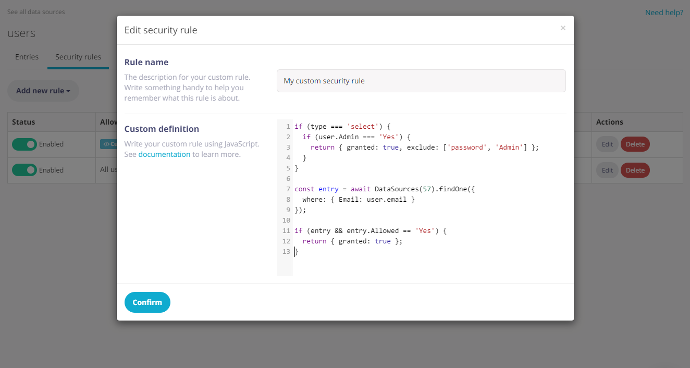

# Securing your Data Sources

## Security rules

Access to Data Sources can be secured via the "Access Rules" tab of the "App Data" section in Fliplet Studio. If you're using specific "Request data requirements" settings in your rules, querying your Data Sources won't work in Fliplet core components unless you write custom queries.

Here's a table showing the type of allowed queries for each data requirement type:

| Data requirement type | Allowed queries                                                                       |
|-----------------------|---------------------------------------------------------------------------------------|
| Field is required     | All queries given they provide the specified column.                                  |
| Field equals          | `{ Field: value }` or `{ Field: { $eq: value } }`                                     |
| Field not equals      | All queries given the value for the field does not contain the specified value        |
| Field contains        | `{ Field: value }` or `{ Field: { $iLike: value } }` or `{ Field: { $like: value } }` |

Here's a sample query for the "contains" data requirement type:

```js
Fliplet.DataSources.connect(123).then(function (connection) {
  return connection.find({
    where: { Email: { $like: '@fliplet.com' } }
  });
});
```

---

## Custom security rules

Fliplet apps can have each of their screens and data sources secured so that they can only be accessed when certain conditions are met. Our Data Sources management UI allows you to define security rules through a easy-to-use wizard. However, depending on the case you may want to write your own security rule from scratch using JavaScript as explained further below.



If you need more control on your security rules granting access to Data Sources, you can write your custom conditions using Javascript. When doing so, **these variables are available to the context of the script**:

- `type` (String) the type of operation the user is attempting to run on the Data Source (`select`, `insert`, `update`, `delete`)
- `user` (Object) the user's session with its data, when the user is logged in
- `query` (Object or Array) the input query (when reading data) or data to write (when inserting or updating an entry). When using the commit endpoint, this will be the array of entries being inserted or updated.
- `entry` (Object) the existing entry being updated, if applicable

Given the possible values of the `query` object, you may need to write your code in a way that it can handle all situations. Here's a full example of a security rule handling all scenarios at once:

```js
switch (type) {
  case 'select':
    // Check scenario when selecting records
    // "query" here is the input query from the API request
    return { granted: query.foo !== 'bar' };

  case 'insert':
    // Check scenario when inserting records.
    // "query" here is the input data being inserted.
    // It can also be an array when committing multiple records at once.
    if (Array.isArray(query)) {
      // Check each object in the input data
      return { granted: query.every(data => data.foo === 'bar') };
    }

    // Check the input data
    return { granted: query.foo === 'bar' };

  case 'update':
    // Check scenario when updating records.
    // "query" here is the input data being updated.
    // It can also be an array when committing multiple records at once.
    // You will also receive the input "entry" object when applicable.
    if (Array.isArray(query)) {
      // Check each object in the input data
      return { granted: query.every(data => data.foo === 'bar') };
    }

    // Check the input data to update and the existing entry
    return { granted: query.foo === 'bar' && entry.data.foobar === true };

  case 'delete':
    // Check scenario when deleting records.
    // "query" here is the input data being updated.
    // It can also be an array when deleting multiple records at once.
    if (Array.isArray(query)) {
      // Check each object in the input data
      return { granted: query.every(data => data.foo === 'bar') };
    }

    // Check the input data
    return { granted: query.foo === 'bar' };
}
```

### Granting access with a custom security rule

A rule needs to return an object with `granted: true` when access is granted to the user. The rule can also return an `exclude` array property alongside the same object with a list of columns that are not allowed to be read, written or updated.

Let's take a look at a basic example for a rule:

```js
if (type === 'select') {
  // Grant access to admin users
  if (user.Admin === 'Yes') {
    return { granted: true };
  }

  // Grant access to any other user, but don't allow reading the "Phone" and "NextOfKin" columns
  return { granted: true, exclude: ['Phone', 'NextOfKin'] };
}

// No further access is granted by this rule to other type of operations
```

### Dealing with different type of operations

Depending on the operation being made, the `query` parameter will have a different value as follows:

- Reading data (selects): the input query to filter the data
- Writing data (inserts and updates): the data being written to the entry
- Deleting data (deletes): the data of the entry being deleted

Additionally, when using the "commit" JS API and REST API the `query` will contain the payload found in the request body. As an example, if you're deleting a list of entries by ID using such endpoint then the `query` parameter will include the `delete` key with the array of IDs being made.

### Make changes to the input query

Rules can also make changes to the input `query` object if required:

```js
if (type === 'select') {
  // Only allow reading records for the same office as the user's
  query.Office = user.Office;

  return { granted: true };
}

if (type === 'insert') {
  // Forces writes to have the office field same as the user's
  query.Office = user.Office;

  // Also generate a "CreatedAt" datetime field for all records added
  query.CreatedAt = Date.now();

  return { granted: true };
}
```

### Checking data when committing changes

If the data source is being updated via the `commit` endpoint (or JS API), the input `query` will reflect the array of entries being inserted or updated — as **the security rule will be called twice** (once per operation).

```js
if (type === 'insert') {
  // This code block will run when evaluating entries to be inserted
  // "query" here is array of entries to insert
} else if (type === 'update') {
  // This code block will run when evaluating entries to be inserted
  // "query" here is the array of entries to update
}
```

### Reading data from other Data Sources

Custom rules can also read data from different Data Sources using the `find` (for finding multiple records) and `findOne` (for finding a single record) methods of the `DataSource` server-side library.

When connecting to a Data Source, you can connect using the ID by passing a number or the Data Source name by passing a string. For example, to connect to a sample data source named "Users", you can use `DataSources('Users')`.

```js
if (type === 'select') {
  var entry = await DataSources(123).findOne({
    where: {
      Office: user.Office,
      Managers: { $in: user.Manager },
      Country: { $like: '%United Kingdom%' }
    }
  });

  // Allow reading data if the user has a manager in the same office
  if (entry) {
    return { granted: true };
  }
}

if (type === 'insert') {
  var entries = await DataSources('Users').find();

  // Only allow writes as long as there are less than 10 entries in the target Data Source
  if (entries && entries.length < 10) {
    return { granted: true };
  }
}
```

As you can see, the `DataSource` function accepts the **input ID or name** of the target Data Source and exposes two interfaces for reading one or multiple records. Both `find` and `findOne` supports the following properties:

- `where` (Object) query to run (supports common operators such as `$like`, `$iLike`, `$lt`, `$gt`, `$lte`, `$gte`, `$eq`, `$in`)
- `limit` (Number, defaults to `100`)
- `offset` (Number, defaults to `0`)

---