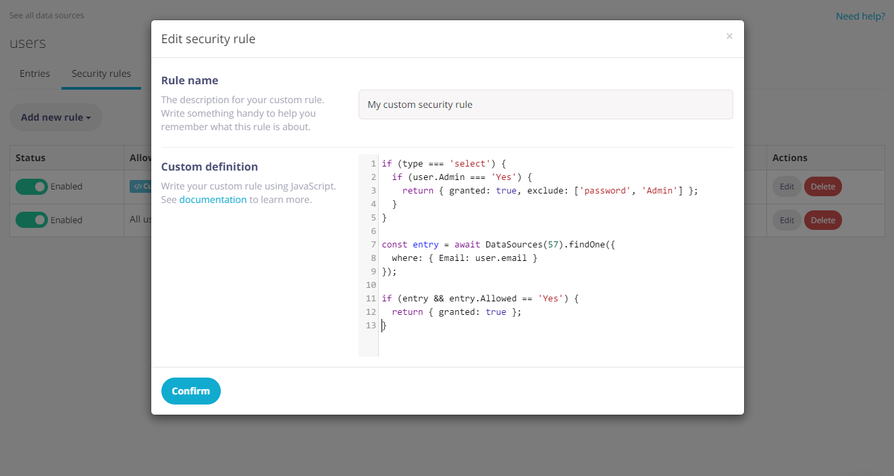

# Securing your Data Sources

## Contents

- [Security rules](#security-rules)
- [Access rule structure](#access-rule-structure)
  - [Defining who can access](#defining-who-can-access)
  - [Restricting columns](#restricting-columns)
  - [Example: role-based access with protected fields](#example-role-based-access-with-protected-fields)
  - [Example: department-scoped access](#example-department-scoped-access)
- [Data requirements and query validation](#data-requirements-and-query-validation)
  - [Data requirement types](#data-requirement-types)
  - [Handlebars templating](#handlebars-templating)
  - [Require syntax](#require-syntax)
- [Custom security rules](#custom-security-rules)
  - [Granting access](#granting-access)
  - [Modifying the input query](#modifying-the-input-query)
  - [Checking data when committing changes](#checking-data-when-committing-changes)
  - [Reading data from other Data Sources](#reading-data-from-other-data-sources)

## Security rules

Access to Data Sources is secured via the **Access Rules** tab of the **App Data** section in Fliplet Studio. Each rule controls who can access the data source, what operations they can perform, and what conditions must be met.

Rules are evaluated from top to bottom. The first rule that grants access is used and evaluation stops — later rules are not checked. If no rules match, access is denied by default. If no rules are defined at all, all access is denied — data sources are locked down until you explicitly add rules.

Note that for read operations, a rule with unmet `require` conditions is **skipped**, not denied — evaluation continues to the next rule. For writes, unmet `require` is a hard rejection. See [Data requirements](#data-requirements-and-query-validation) for details.

## Access rule structure

Each access rule is a JSON object with the following properties:

| Property | Type | Required | Description |
|---|---|---|---|
| `type` | Array of strings | Yes | Operations this rule applies to: `"select"`, `"insert"`, `"update"`, `"delete"` |
| `allow` | String or Object | Yes | Who can access: `"all"`, `"loggedIn"`, `{ "user": {...} }`, or `{ "tokens": [...] }` |
| `enabled` | Boolean | No | Whether the rule is active (defaults to `true`). Set to `false` to disable the rule without deleting it — disabled rules are skipped during evaluation |
| `include` | Array of strings | No | Whitelist of accessible columns. If both `include` and `exclude` are present, `include` takes precedence |
| `exclude` | Array of strings | No | Blacklist of hidden columns. Ignored if `include` is also present |
| `require` | Array | No | Data requirements that must be met (see [Data requirements](#data-requirements-and-query-validation)) |
| `appId` | Array of numbers | No | Restrict this rule to specific app IDs (applies to all apps if omitted) |
| `name` | String | No | Descriptive label for identifying the rule in Studio |
| `script` | String | No | Custom JavaScript code for advanced security logic. When present, `allow` and `type` are ignored — see [Custom security rules](#custom-security-rules) |

### Defining who can access

The `allow` property supports four modes:

**All users** (including anonymous):

```json
{ "allow": "all" }
```

**Logged-in users only:**

```json
{ "allow": "loggedIn" }
```

`allow: "loggedIn"` checks whether the current request is authenticated. This includes users authenticated through the `dataSource` passport, such as Data Source Login, Email Verification, and SMS verification.

<p class="quote"><strong>Important:</strong> <code>allow: "loggedIn"</code> only checks whether the user is authenticated. It does not limit which records they can access. Use <code>require</code> with <code>{{user[...]}}</code> to scope access to the authenticated user's data.</p>

**Specific users** (filtered by session data). `allow.user` checks the logged-in user's **identity** — use it with literal values to control *who* can access. To control *which records* they can access, use `require` instead (see [Data requirements](#data-requirements-and-query-validation)):

```json
{
  "allow": {
    "user": {
      "Role": { "equals": "Admin" }
    }
  }
}
```

User filters support three operators: `equals`, `notequals`, and `contains`. Multiple conditions in the same `user` object are combined with AND logic. For OR logic, create separate rules instead.

<p class="warning"><strong>Important:</strong> <code>allow.user</code> conditions check the logged-in user's session data — not data source records. Always use <strong>literal values</strong> here (e.g., <code>"Admin"</code>, <code>"Manager"</code>). Although Handlebars syntax is supported, using it in <code>allow.user</code> (e.g., <code>{{ user.[Department] }}</code>) compares the user's field against itself — always true, granting access to any logged-in user. Handlebars templates are useful in <code>require</code> conditions, where they scope queries by the user's data. See <a href="#data-requirements-and-query-validation">Data requirements</a>.</p>


```json
{
  "allow": {
    "user": {
      "Role": { "equals": "Manager" },
      "Status": { "notequals": "Inactive" }
    }
  }
}
```


**Specific API token:**

```json
{
  "allow": {
    "tokens": [42857]
  }
}
```

### Restricting columns

Use `include` to whitelist specific columns, or `exclude` to hide specific columns. If both are specified in the same rule, `include` takes precedence — only the whitelisted columns are returned, and the `exclude` list has no effect. If neither is specified, all columns are accessible.

```json
{
  "type": ["select"],
  "allow": "loggedIn",
  "exclude": ["Password", "SSN", "Salary"]
}
```

<p class="warning"><strong>Security note:</strong> Always exclude privilege fields (e.g., <code>Admin</code>, <code>Role</code>, <code>Permissions</code>) from rules that allow logged-in users to insert or update records. Otherwise, users can escalate their own privileges.</p>

### Example: role-based access with protected fields

This example shows an "Employees" data source where admins have full access, regular users can read records (without sensitive fields), and can only update their own record or insert records with a non-privileged role.

**Data source columns:**

| Email | First Name | Role | Department | Salary | Password | Admin | Permissions |
|---|---|---|---|---|---|---|---|
| alice@acme.com | Alice | Admin | Engineering | 150000 | ••••• | Yes | all |
| bob@acme.com | Bob | User | Marketing | 85000 | ••••• | No | read |
| carol@acme.com | Carol | User | Engineering | 95000 | ••••• | No | read |

**Security rules:**


```json
[
  {
    "type": ["select", "insert", "update", "delete"],
    "allow": { "user": { "Role": { "equals": "Admin" } } },
    "enabled": true
  },
  {
    "type": ["select"],
    "allow": "loggedIn",
    "exclude": ["Password", "Salary"],
    "enabled": true
  },
  {
    "type": ["update"],
    "allow": "loggedIn",
    "require": [
      { "Email": { "equals": "{{user.[Email]}}" } }
    ],
    "exclude": ["Role", "Admin", "Permissions"],
    "enabled": true
  },
  {
    "type": ["insert"],
    "allow": "loggedIn",
    "require": [
      "Email",
      "First Name",
      { "Email": { "equals": "{{user.[Email]}}" } },
      { "Role": { "equals": "User" } }
    ],
    "exclude": ["Admin", "Permissions"],
    "enabled": true
  }
]
```


**Queries that succeed:**

When Alice (Admin) is logged in, the first rule matches — she has full access to all records and columns:

```js
// JS API — Alice reads all records including sensitive fields
const connection = await Fliplet.DataSources.connectByName('Employees');
const allRecords = await connection.find();
// Returns all 3 records with all columns including Salary and Password
```

```plaintext
// REST API equivalent
POST /v1/data-sources/123/data/query
Auth-token: <Alice's token>
Content-Type: application/json

// "type" here is the REST API operation type, not a security rule field
{ "type": "select" }

// Response (200 OK): all entries with all columns
```

When Bob (User) is logged in, the second rule matches for reads — he can see records but `Password` and `Salary` are excluded:

```js
// JS API — Bob reads records (sensitive columns automatically excluded)
const connection = await Fliplet.DataSources.connectByName('Employees');
const records = await connection.find();
// Returns all 3 records, but each record is missing Password and Salary
// e.g. { Email: "alice@acme.com", "First Name": "Alice", Role: "Admin", Department: "Engineering", Admin: "Yes", Permissions: "all" }
```

Bob can update his own record (the third rule requires his email in the data):

```js
// JS API — Bob updates his own name
const connection = await Fliplet.DataSources.connectByName('Employees');
await connection.update(456, {
  Email: 'bob@acme.com',
  'First Name': 'Robert'
});
// Succeeds — Email matches Bob's session, and Role/Admin/Permissions are excluded from writes
```

```plaintext
// REST API equivalent
PUT /v1/data-sources/123/data/456
Auth-token: <Bob's token>
Content-Type: application/json

{ "Email": "bob@acme.com", "First Name": "Robert" }

// Response (200 OK): updated entry
```

**Queries that fail:**

When a query is denied, the API responds with HTTP status **400** and a JSON error body. The `message` field changes based on the denied operation — for example, `"do not allow this app to read data"` for selects, or `"do not allow this app to insert data"` for inserts:

```json
{
  "message": "The security rules for the Data Source \"Employees\" do not allow this app to read data.",
  "type": "datasource.access",
  "payload": { "dataSourceId": 123 }
}
```

In the JS API, the promise is rejected with this error object. The `message` adapts to include the data source name and the specific operation that was denied (read, insert, update, or delete). The `type` is always `"datasource.access"` and `payload.dataSourceId` identifies the data source.

```js
// Bob tries to update another user's record — fails
// (Email does not match Bob's session, so the require condition is not met)
await connection.update(789, {
  Email: 'carol@acme.com',
  'First Name': 'Carolina'
});

// Bob tries to escalate his own role — fails
// (Role is excluded from the update rule, so it cannot be written)
await connection.update(456, {
  Email: 'bob@acme.com',
  Role: 'Admin'
});

// Bob tries to insert a record with an admin role — fails
// (the insert rule requires Role: "User")
await connection.insert({
  Email: 'bob@acme.com',
  'First Name': 'Bob Clone',
  Role: 'Admin'
});

// Bob tries to delete a record — fails
// (no delete rule matches for non-admin users)
await connection.removeById(789);
```

### Example: department-scoped access

In this example, managers see all records for their department, regular users only see their own record, and inserts are restricted to the user's department. Department scoping is enforced through `require` conditions on the query, not through `allow.user` (which checks the user's identity, not the data being accessed).

**Data source columns:**

| Email | Name | Role | Department | Salary | ManagerNotes |
|---|---|---|---|---|---|
| alice@acme.com | Alice | Manager | Engineering | 150000 | Top performer |
| bob@acme.com | Bob | User | Engineering | 85000 | |
| carol@acme.com | Carol | User | Marketing | 95000 | |
| dave@acme.com | Dave | Manager | Marketing | 140000 | Needs training |

**Security rules:**


```json
[
  {
    "type": ["select"],
    "allow": {
      "user": { "Role": { "equals": "Manager" } }
    },
    "require": [
      { "Department": { "equals": "{{user.[Department]}}" } }
    ],
    "exclude": ["Salary"],
    "enabled": true
  },
  {
    "type": ["select", "update"],
    "allow": "loggedIn",
    "require": [
      { "Email": { "equals": "{{user.[Email]}}" } }
    ],
    "exclude": ["Salary", "ManagerNotes"],
    "enabled": true
  },
  {
    "type": ["insert"],
    "allow": "loggedIn",
    "require": [
      "Name",
      { "Department": { "equals": "{{user.[Department]}}" } },
      { "CreatedBy": { "equals": "{{user.[Email]}}" } }
    ],
    "exclude": ["Role", "Admin"],
    "enabled": true
  }
]
```


The first rule uses `allow.user` to check the user's role (a literal match — "is this user a Manager?") and `require` to enforce department scoping on the query (the `where` clause must include the user's own department). This combination ensures only managers can use the rule *and* they can only query their own department's data.

**Queries that succeed:**

When Alice (Manager, Engineering) is logged in, the first rule matches — she is a Manager, and her query includes `Department: 'Engineering'` which satisfies the `require` condition:

```js
// JS API — Alice reads all Engineering records
const connection = await Fliplet.DataSources.connectByName('Staff');
const records = await connection.find({
  where: { Department: 'Engineering' }
});
// Returns Alice and Bob's records, excluding Salary
// e.g. { Email: "bob@acme.com", Name: "Bob", Role: "User", Department: "Engineering", ManagerNotes: "" }
```

```plaintext
// REST API equivalent
POST /v1/data-sources/123/data/query
Auth-token: <Alice's token>
Content-Type: application/json

{ "type": "select", "where": { "Department": "Engineering" } }

// Response (200 OK): Alice and Bob's entries, Salary excluded
```

When Bob (User, Engineering) is logged in, the first rule does not match (wrong role). The second rule matches — he must filter by his own email:

```js
// JS API — Bob reads his own record
const connection = await Fliplet.DataSources.connectByName('Staff');
const records = await connection.find({
  where: { Email: 'bob@acme.com' }
});
// Returns Bob's record only, excluding Salary and ManagerNotes
```

Bob can insert a record in his own department:

```js
// JS API — Bob creates a record in Engineering
await connection.insert({
  Name: 'New Hire',
  Department: 'Engineering',
  CreatedBy: 'bob@acme.com'
});
// Succeeds — all require conditions are met, Role and Admin are excluded from writes
```

```plaintext
// REST API equivalent (Fliplet uses PUT for both inserts and updates on this endpoint)
PUT /v1/data-sources/123/data
Auth-token: <Bob's token>
Content-Type: application/json

{ "Name": "New Hire", "Department": "Engineering", "CreatedBy": "bob@acme.com" }

// Response (200 OK): new entry
```

**Queries that fail:**

```js
// Alice (Manager) tries to read Marketing records — fails
// (the require condition demands Department matching Alice's own department "Engineering";
// "Marketing" does not match, so the first rule is skipped; no other rule grants broad access)
await connection.find({
  where: { Department: 'Marketing' }
});

// Bob tries to read all records without filtering by email — fails
// (the second rule requires Email matching Bob's session; without a where clause,
// the require condition is not met, the rule is skipped, and no subsequent rule grants access)
await connection.find();

// Bob tries to read Alice's record — fails
// (Email does not match Bob's session)
await connection.find({
  where: { Email: 'alice@acme.com' }
});

// Bob tries to insert a record in Marketing — fails
// (Department does not match Bob's department "Engineering")
await connection.insert({
  Name: 'Spy',
  Department: 'Marketing',
  CreatedBy: 'bob@acme.com'
});

// Bob tries to insert with a different CreatedBy — fails
// (CreatedBy must equal Bob's email)
await connection.insert({
  Name: 'Fake',
  Department: 'Engineering',
  CreatedBy: 'alice@acme.com'
});
```

## Data requirements and query validation

The `require` property defines conditions that incoming queries must satisfy. This is not the same as querying data — it controls how queries are **assessed against the rule's data requirements**.

<p class="info">If you add data requirements to your rules, Fliplet core components that query the data source (e.g., <strong>List from Data Source</strong>, <strong>Chart</strong>, <strong>Form</strong>) may stop working because they issue broad queries without the <code>where</code> clauses that <code>require</code> demands. You will need to either add a permissive rule (without <code>require</code>) scoped to those components' app IDs, or replace the component queries with custom code that satisfies the requirements.</p>


For example, to allow a specific app's components to read without `require` constraints while keeping other apps locked down:

```json
{
  "type": ["select"],
  "allow": "loggedIn",
  "appId": [456, 789],
  "enabled": true
}
```

This rule grants read access to logged-in users only when the request originates from app 456 or 789. Place it before stricter rules so that the matching apps get broad access while other apps fall through to rules with `require` conditions.

The behavior of `require` varies by operation type:

- **For `select` and `delete` operations:** The client's query must include a `where` clause that satisfies all requirements, or the rule does not match. For example, if a rule requires `{ "Email": { "equals": "{{user.[Email]}}" } }`, every `find()` call must include `where: { Email: user.Email }` (or the equivalent `$eq` operator) for that rule to grant access. To obtain the user's session data client-side, use the [Session API](API/fliplet-session.html). If the requirements are not met, the rule is **skipped** (not rejected) — evaluation falls through to the next rule. This means a more permissive rule below could still grant access. Design your rule order carefully: place restrictive rules first and ensure no later rule inadvertently grants broader access than intended.
- **For `insert` and `update` operations:** Validates that the submitted data contains the required fields and values. If the data does not match, the write is **rejected immediately** — unlike reads, unmet requirements on a write do not fall through to the next rule.

<p class="quote"><strong>Key difference:</strong> Unmet <code>require</code> on a read = rule skipped, next rule evaluated. Unmet <code>require</code> on a write = request denied outright. This means a permissive read rule further down the list can still grant access, but a failed write requirement stops evaluation.</p>

### Data requirement types

`require` accepts an array of strings (required field names) and objects (field conditions). Four requirement types are available:

| Requirement type | Description | Query patterns that satisfy this requirement |
|---|---|---|
| Field is required | The query must include the specified column | Any query that provides the column as a key |
| Field equals | The query value for the column must match exactly | `{ Field: value }` or `{ Field: { $eq: value } }` |
| Field not equals | The query value for the column must not match the specified value | `{ Field: { $ne: value } }` or any query where the field's value differs from the specified value |
| Field contains | The query value for the column must contain the specified substring | `{ Field: value }` or `{ Field: { $iLike: value } }` or `{ Field: { $like: value } }` |

<p class="quote">These requirement types (<code>equals</code>, <code>notequals</code>, <code>contains</code>) are <strong>not</strong> query operators — they define how the security rule validates incoming queries. For the full list of query operators you can use when reading and writing data, see the <a href="API/datasources/query-operators.html">query operators reference</a>.</p>

### Handlebars templating

Condition values can reference the logged-in user's session data using Handlebars syntax. This enables dynamic, per-user access scoping. Use bracket notation (e.g., `[Email]`) for field names — it is required for names with spaces or special characters (e.g., `{{user.[First Name]}}`), and also works for simple names. Plain dot notation (`{{user.Email}}`) works only for field names without spaces.

- `{{user.[Email]}}` — the user's email address
- `{{user.[Department]}}` — the user's department
- `{{user.[Role]}}` — the user's role
- `{{user.[ID]}}` — the user's data source entry ID

For Data Source Login, Email Verification, and SMS verification, these values come from the authenticated row in the authentication data source. For example, `{{user.[Email]}}` resolves to the verified email address, and `{{user.[ID]}}` resolves to the authenticated entry ID.

### Require syntax

**Required fields** (string) — the query must include these columns:

```json
"require": ["Email", "FirstName", "Department"]
```

**Field conditions** (object with operator) — the query must match these conditions:


```json
"require": [
  { "Email": { "equals": "{{user.[Email]}}" } },
  { "Status": { "notequals": "Archived" } },
  { "Department": { "contains": "{{user.[Department]}}" } }
]
```


You can mix both formats in the same array:


```json
"require": [
  "Title",
  "Description",
  { "CreatedBy": { "equals": "{{user.[Email]}}" } },
  { "Status": { "equals": "Draft" } }
]
```


For full examples of `require` in practice — including sample data, succeed queries, and fail queries — see [role-based access with protected fields](#example-role-based-access-with-protected-fields) and [department-scoped access](#example-department-scoped-access) above.

### Example: email verification with secured data access

The following rule allows authenticated users to read only the records that match their verified email address:


```json
{
  "type": ["select"],
  "allow": "loggedIn",
  "require": [
    { "Email": { "equals": "{{user.[Email]}}" } }
  ]
}
```


Client-side code must include a matching `where` clause:

```js
Fliplet.User.getCachedSession().then(function (session) {
  var user = _.get(session, 'entries.dataSource.data');

  if (!user) {
    return;
  }

  return Fliplet.DataSources.connectByName('Orders').then(function (connection) {
    return connection.find({
      where: { Email: user.Email }
    });
  });
});
```

This succeeds because the user is authenticated and the query satisfies the rule's `require`.

The following query does not satisfy the rule:

```js
Fliplet.DataSources.connectByName('Orders').then(function (connection) {
  return connection.find();
});
```

For reads, an unmet `require` means the rule is skipped. Access is only granted if a later rule allows it.

## Custom security rules

For advanced logic beyond what the standard rule properties support, you can write custom JavaScript security rules.



The custom security rule editor in Fliplet Studio displays a code editor where you write JavaScript that controls access. The rule name and enabled toggle appear above the code area.

<p class="warning"><strong>Important:</strong> When a rule has a <code>script</code>, the script is the <strong>sole determinant</strong> of access. Standard rule fields like <code>allow</code> and <code>type</code> are ignored — the script runs regardless of login status or operation type. Your script must perform its own identity and operation checks (e.g., <code>if (!user) return { granted: false };</code>). If the script does not return a value (e.g., an unhandled operation type falls through without a <code>return</code>), access is <strong>denied by default</strong>.</p>

When writing a custom rule, these variables are available in the script context:

- `type` (String) — the operation the user is attempting: `select`, `insert`, `update`, or `delete`
- `user` (Object) — the authenticated user's session data, or `undefined` if not logged in. For data-source passport sessions (e.g., Email Verification, Fliplet Login), this contains the flat column values from the user's row in the authentication data source (e.g., `user.Email`, `user.Role`). For SAML2 sessions, it contains the assertion attributes.
- `query` (Object or Array) — **important: the shape of this variable changes depending on the operation type:**
  - **`select`**: the unwrapped `where` object from the request (e.g., if the client sends `find({ where: { Email: "a@b.com" } })`, the rule receives `{ Email: "a@b.com" }`)
  - **`insert`** / **`update`**: the data being written to the entry. When called via the `commit` endpoint, `query` is an array of entries — see [Checking data when committing changes](#checking-data-when-committing-changes)
  - **`delete`**: the current data of the entry being deleted (populated by the server from the existing record, not sent by the client)
- `entry` (Object) — the existing entry being updated, with `id` (Number) and `data` (Object containing the entry's current column values) properties. `undefined` for other operation types
- `DataSources` (Function) — server-side library for reading data from other data sources. See [Reading data from other Data Sources](#reading-data-from-other-data-sources)

Your code should handle all relevant operation types. Here is an example:

```js
// Always check for unauthenticated access first
if (!user) {
  return { granted: false };
}

switch (type) {
  case 'select':
    // "query" is the unwrapped where object from the API request.
    // If the client sends find() with no where clause, query may be empty.
    return { granted: query && query.Department === user.Department };

  case 'insert':
    // "query" is the data being inserted.
    // It can also be an array when committing multiple records at once.
    if (Array.isArray(query)) {
      return { granted: query.every(data => data.Department === user.Department) };
    }

    return { granted: query.Department === user.Department };

  case 'update':
    // "query" is the data being updated.
    // It can also be an array when committing multiple records at once.
    // "entry" is the existing record (with id and data properties) when applicable.
    if (Array.isArray(query)) {
      return { granted: query.every(data => data.Department === user.Department) };
    }

    return { granted: query.Department === user.Department && entry && entry.data.Active === true };

  case 'delete':
    // "query" is the data of the entry being deleted.
    // It can also be an array when deleting multiple records at once.
    if (Array.isArray(query)) {
      return { granted: query.every(data => data.CreatedBy === user.Email) };
    }

    return { granted: query.CreatedBy === user.Email };
}
```

### Granting access

Return an object with `granted: true` to grant access. You can also return an `exclude` or `include` array to restrict which columns the user can access:

```js
if (type === 'select') {
  if (!user) {
    return { granted: false };
  }

  // Grant full access to admin users
  if (user.Admin === 'Yes') {
    return { granted: true };
  }

  // Grant access to any other logged-in user, but hide sensitive columns
  return { granted: true, exclude: ['Phone', 'NextOfKin'] };
}

// No further access is granted by this rule to other operation types
```

<p class="warning"><strong>Important:</strong> You must return an object — bare boolean values (e.g., <code>return true</code>) are not supported and will be treated as a denial. Always use <code>return { granted: true }</code> or <code>return { granted: false }</code>.</p>

### Modifying the input query

Rules can modify the `query` object to enforce constraints:

```js
if (!user) {
  return { granted: false };
}

if (type === 'select') {
  // Only allow reading records for the same office as the user's
  query.Office = user.Office;

  return { granted: true };
}

if (type === 'insert') {
  // Forces writes to have the office field same as the user's
  query.Office = user.Office;

  // Also generate a "CreatedAt" datetime field for all records added
  query.CreatedAt = Date.now();

  return { granted: true };
}
```

### Checking data when committing changes

When a data source is updated via the `commit` endpoint (or JS API), `query` is always an **array** of flat data objects — not a single object. The security rule runs separately for each operation type in the commit (inserts, updates, and deletes).

<p class="quote"><strong>Note:</strong> For all three operation types during a commit, <code>query</code> is an array of flat data objects (the entry's column values). For deletes, the server loads the existing entries and provides their data — you receive the same flat shape as inserts and updates, not an array of IDs.</p>

```js
if (type === 'insert') {
  // "query" is the array of entries to insert
  // e.g. [{ Name: "Alice", Department: "Engineering" }, { Name: "Bob", Department: "Marketing" }]
} else if (type === 'update') {
  // "query" is the array of entry data being written
  // e.g. [{ Name: "Alice Updated", Department: "Engineering" }, { Name: "Bob Updated", Department: "Marketing" }]
} else if (type === 'delete') {
  // "query" is the array of existing entry data for the entries being deleted
  // e.g. [{ Name: "Alice", Department: "Engineering" }, { Name: "Dave", Department: "Marketing" }]
}
```

### Reading data from other Data Sources

Custom rules can read data from other Data Sources using the `find` (multiple records) and `findOne` (single record) methods of the `DataSources` server-side library. These reads run at **server level** and bypass all security rules on the target data source.

<p class="quote">Cross-data-source lookups add a database round-trip per request and are not cached. Keep queries efficient and use <code>findOne</code> when you only need a single record. Script execution has a <strong>3-second timeout</strong> — if the script does not return within 3 seconds, access is denied. Async operations (like <code>DataSources</code> queries) are supported via <code>await</code>.</p>

Connect using the data source ID (number) or name (string):

```js
if (!user) {
  return { granted: false };
}

if (type === 'select') {
  const entry = await DataSources(123).findOne({
    where: {
      Office: user.Office,
      Managers: { $in: user.Manager },
      Country: { $like: '%United Kingdom%' }
    }
  });

  // Allow reading data if the user has a manager in the same office
  if (entry) {
    return { granted: true };
  }
}

if (type === 'insert') {
  const entries = await DataSources('Users').find();

  // Only allow writes as long as there are fewer than 10 entries in the target Data Source
  if (entries && entries.length < 10) {
    return { granted: true };
  }
}
```

`find` returns an array of matching entries (empty array if none match). `findOne` returns a single entry object, or `null` if no match is found.

Both methods accept the following properties:

- `where` (Object) — query filter supporting [standard query operators](API/datasources/query-operators.html) such as `$eq`, `$ne`, `$like`, `$iLike`, `$gt`, `$gte`, `$lt`, `$lte`, `$in`
- `limit` (Number, defaults to `100`)
- `offset` (Number, defaults to `0`)

<p class="quote">Use <code>DataSources('Name')</code> (data source name) instead of <code>DataSources(123)</code> (ID) in custom scripts. Data source names are preserved during app clone, so name-based lookups continue to work without manual remapping.</p>
