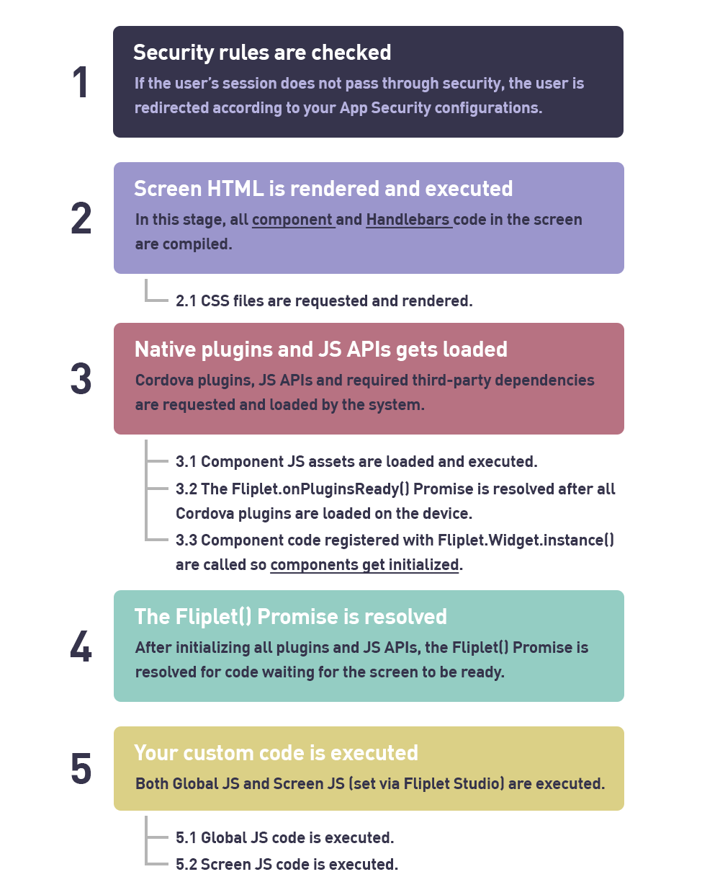

# App Execution flow

## Execution flow explained

Fliplet Apps go through a series of rendering steps before screens are displayed to the end user. In the flow diagram below you can learn the different steps, how they interact with each other and how to properly code your components or app code.

---

## Can I run my code before components are loaded?

You technically can by adding such code in the HTML of your screen, since such HTML is rendered (and executed) before components and even core JS APIs are loaded. As an example, adding a `` tag would work although you won't have access to any JS API aside from `Fliplet()` (the Fliplet promise) `Fliplet.Env` and `Fliplet.Hooks` since they are the only runtime JS APIs available to the HTML code.

---

## When do hooks run?

Hooks can technically run at any time during the app lifecycle, but they are mostly coded so that they run after custom code has ran. This is to ensure custom code has registered any hook before such events are actually broadcasted by the system or any component having exposed such hook(s). E.g.:

1. Custom code registers a new hook listener
2. Later in the app lifecycle, the hook event is broadcasted so the connected listener runs the registered callback.

---

## When does a screen transition occur?

As a rule of thumb, **web apps** transition and render the page as soon as possible as transitions such as fade and slide are not available on web. On the other hand, on **mobile apps** screens transitions generally take place between steps 4 and 5 of the execution flow presented above. This ensures the screen is rendered in its final form before it's presented to the end user.