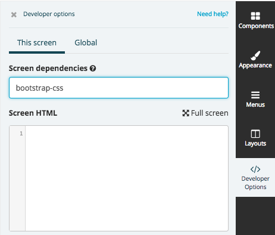

# The JS APIs

As most of our stack is made of Javascript — and you will be using it quite a lot — we have built a big set of Javascript APIs which enable you to interact with the different parts of our system, while speeding up the development as they help you with some basic functionality like other similar tools.

Please note: the JS APIs are more of a **SDK** rather than a **framework**. You are mostly free to choose how to build your components and themes and which framework to use (or not).

---

## How to use them

Our JS APIs can be used when developing components and themes, but also when writing custom code for your screens in Fliplet Studio.

### 1. Fliplet CLI

Please refer to the specific `json` file in order to add dependencies to components, themes and menus.

### 2. Fliplet Studio

Adding our dependencies to apps screens only takes a few seconds. Just browse to the screen you want to add the package to, then click on the **Developer options** and add the **package name** in the **screen dependencies** section as shown:



Then, click the save button and you're good to go! You can now use the methods that the package is exposing.

---

## Dependencies (packages)

To list out all the available packages in our system, use the `list-assets` command of the CLI:

```
$ fliplet list-assets

• fliplet-core: 1.0
  -- category: first-party
  -- dependencies: jquery
  -- includes: fliplet-core.bundle.js, fliplet-core.bundle.css

• jquery: 3.0.0 2.2.4
    -- category: vendor
    -- includes: jquery.js

...
```

You can also get them as a [JSON](https://api.fliplet.com/v1/widgets/assets) hitting our [API endpoint](https://api.fliplet.com/v1/widgets/assets).

You can find a list of available assets on the [Fliplet approved libraries](Fliplet-approved-libraries) page.

### First-party packages

The different parts of our SDK are split into different packages which includes one or more functionalities. To use them, you will need to import them as dependencies in your components (or themes).

Here's an example to give you a quick idea of how it works:

*1. I declare I want to use the package named `fliplet-media` in my component dependencies.*

*2. I can then use the JS APIs provided by the package, like `Fliplet.Media.Files.upload()` to upload a file.*

Our [API Documentation](API-Documentation.md) and open-source components will give you plenty of examples about the available methods to use.

Note: dependencies can include other dependencies (e.g. `fliplet-core` also includes `jquery`).

[Read more on dependencies and assets →](Dependencies-and-assets)
{: .buttons}

### Third-party packages

Our dependencies also include common Javascript libraries such as jQuery, lodash, tinymce and many others. We recommend to use them if available (rather than bundling up your own version) to ensure minimum footprint when the apps are built.

## Promises

Our SDK uses [Javascript promises](https://developer.mozilla.org/en-US/docs/Web/JavaScript/Reference/Global_Objects/Promise) for all asynchronous results, e.g. when content needs to be read from an API or the device.

These are some examples of using Promises so that asynchronous calls are chained together effectively.

This is an example that chains two data source calls together and outputs the result to an html tag. Notice the `return` before any asynchronous call to ensure proper chaining.

```js
//Connect to DS 123 and pass a query
Fliplet.DataSources.connect(123)
  .then(function (connection) {
    return connection.find({
      where: {
        sum: { $gt: 10 },
        name: { $in: ["Nick", "Tony"] },
      },
    });
  })
  .then(function (firstRecords) {
    //Connect to DS 456 and pass a query
    return Fliplet.DataSources.connect(456)
      .then(function (connection) {
        return connection.find({
          where: {
            name: "John",
          },
        });
      })
      .then(function (secondRecords) {
        //Concatenate the two arrays into one using lodash _.concat() function
        var finalRecords = _.concat(firstRecords, secondRecords);

        finalRecords.forEach(function (row) {
          // do something for each row, e.g. append it to a html tag
          $(".foo").append(row.data.bar);
        });
      });
  });
```

This example is using our List From Data Source (LFD) component’s hook and our Data Source JS API to ensure that we can connect to a data source and manipulate the data, for e.g merging the data into the LFD records.

```js
Fliplet.Hooks.on("flListDataAfterGetData", function (options) {
  //Connect to DS 1234 and get the record whose Office equals London
  return Fliplet.DataSources.connect(1234).then(function (connection) {
    return connection
      .find({
        where: {
          Office: { $eq: "London" },
        },
      })
      .then(function (records) {
        //Here you can merge the records with the options.records from the LFD.
      });
  });
});
```

Make sure you're familiar with promises before diving into building components.

---

When you're ready, move to the next section of the documentation to start building your first component.

[Build a component →](Building-components.md)
{: .buttons}
