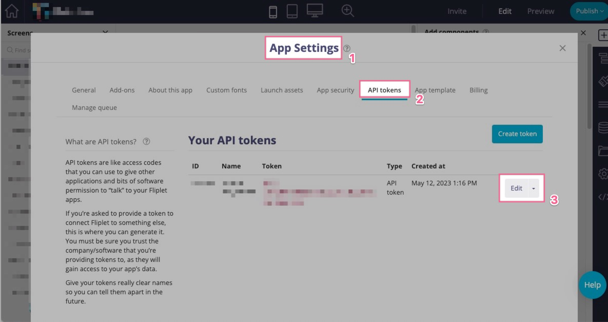
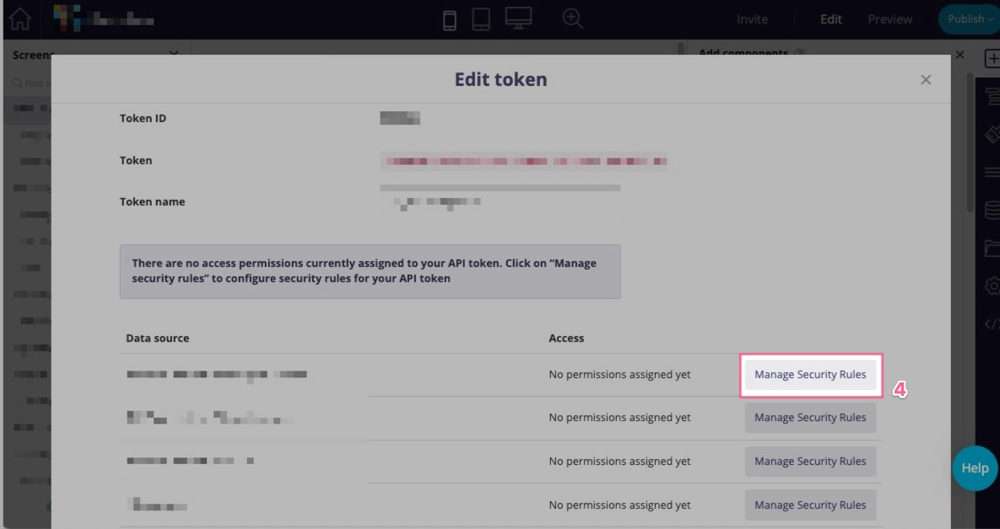

# Data Sources REST APIs

The Data Source REST APIs allows you to interact and make any sort of change to your app's Data Sources.

<p class="warning"><strong>Note:</strong> This RESTful API is intended to be used by 3rd party software such as external integrations. <strong>If you're using this in a Fliplet App, please use the <a href="/API/fliplet-datasources.html">Data Sources JS APIs</a> instead.</strong></p>

---

### Table of contents

- [Data Sources REST APIs](#data-sources-rest-apis)
    - [Table of contents](#table-of-contents)
  - [Authentication](#authentication)
  - [Authenticating when using security rules](#authenticating-when-using-security-rules)
  - [Data source access](#data-source-access)
  - [Resources](#resources)
    - [Data Source](#data-source)
    - [Data Source Entry](#data-source-entry)
  - [Endpoints](#endpoints)
    - [Get the data sources belonging to an app or organization](#get-the-data-sources-belonging-to-an-app-or-organization)
      - [`GET v1/data-sources`](#get-v1data-sources)
    - [Get a data source by its ID](#get-a-data-source-by-its-id)
      - [`GET v1/data-sources/<dataSourceId>`](#get-v1data-sourcesdatasourceid)
    - [Get a data source by its Name](#get-a-data-source-by-its-name)
      - [`GET v1/data-sources/<dataSourceName>`](#get-v1data-sourcesdatasourcename)
    - [Create a data source](#create-a-data-source)
      - [`POST v1/data-sources`](#post-v1data-sources)
    - [Update a data source attributes](#update-a-data-source-attributes)
    - [`PUT v1/data-sources/<dataSourceId>`](#put-v1data-sourcesdatasourceid)
    - [Delete a data source and its entries from the system](#delete-a-data-source-and-its-entries-from-the-system)
      - [`DELETE v1/data-sources/<dataSourceId>`](#delete-v1data-sourcesdatasourceid)
    - [Bulk-import entries for a data source](#bulk-import-entries-for-a-data-source)
      - [`POST v1/data-sources/<dataSourceId>/data`](#post-v1data-sourcesdatasourceiddata)
    - [Empty a data source (truncate)](#empty-a-data-source-truncate)
      - [`POST v1/data-sources/<dataSourceId>/data`](#post-v1data-sourcesdatasourceiddata-1)
    - [Commit a series of changes to a data source](#commit-a-series-of-changes-to-a-data-source)
      - [`POST v1/data-sources/<dataSourceId>/commit`](#post-v1data-sourcesdatasourceidcommit)
    - [Run queries on a data source](#run-queries-on-a-data-source)
      - [`POST v1/data-sources/<dataSourceId>/data/query`](#post-v1data-sourcesdatasourceiddataquery)
    - [Get a data source entry by its ID](#get-a-data-source-entry-by-its-id)
      - [`GET v1/data-sources/<dataSourceId>/data/<entryId>`](#get-v1data-sourcesdatasourceiddataentryid)
    - [Insert a new entry to a data source](#insert-a-new-entry-to-a-data-source)
      - [`PUT v1/data-sources/<dataSourceId>/data`](#put-v1data-sourcesdatasourceiddata)
    - [Update an existing entry in a data source](#update-an-existing-entry-in-a-data-source)
      - [`PUT v1/data-sources/<dataSourceId>/data/<entryId>`](#put-v1data-sourcesdatasourceiddataentryid)
    - [Delete an entry from a data source](#delete-an-entry-from-a-data-source)
      - [`DELETE v1/data-sources/<dataSourceId>/data/<entryId>`](#delete-v1data-sourcesdatasourceiddataentryid)
    - [Insert a new entry with files into a data source](#insert-a-new-entry-with-files-into-a-data-source)
      - [`PUT v1/data-sources/<dataSourceId>/data`](#put-v1data-sourcesdatasourceiddata-1)
    - [Get unique values for data source columns](#get-unique-values-for-data-source-columns)
      - [`GET v1/data-sources/<dataSourceId>/indexes/<indexes>`](#get-v1data-sourcesdatasourceidindexesindexes)
  - [Versioning](#versioning)
    - [Get list of versions of a data source](#get-list-of-versions-of-a-data-source)
    - [Get all entries for a version](#get-all-entries-for-a-version)
    - [Restore a specific version to a data source](#restore-a-specific-version-to-a-data-source)

---

## Authentication

Please head to the [how to authenticate](authenticate.md) page of the documentation to read more about how you can authorize your client to make API requests to Fliplet.

---

## Authenticating when using security rules

If your data source has defined specific permissions with security rules, additional steps must be taken to sign the requests:

1. Ensure the `auth_token` being used is an **API token** created via Fliplet Studio.
2. Ensure the app for the created API token has access to the Data Source.
3. Set up the relevant **security rules** for the API token (e.g. read/write access)

Here is a sample cURL request requesting data for a data source:

```
curl -X GET \
	"https://api.fliplet.com/v1/data-sources/123/data/456" \
	-H "Auth-token: eu--abcdef-123456678" \
```

---

## Data source access

Data sources requires access to be accessed to. Roles can have multiple permissions: **read, write, update, delete, count**. Once you create a data source, permissions need to be assigned to it.

If an API token you're using doesn't have access to one of your organization data sources, you will need to grant permissions to it via Fliplet Studio:

1. Go to the **App settings**<sup>1</sup> >> **API tokens**<sup>2</sup> section of Fliplet Studio.
2. Click **Edit**<sup>3</sup> for the token you need to add access to. This will list all the data sources accessible by the app in an overlay.
3. In the overlay, find the data source you want to add the user to and click **Manage Security Rules**<sup>4</sup>.
4. Set up the relevant security rules for your API token.





---

## Resources

Before heading deep into describing the API endpoints, let's describe what a **Data Source** and **Data Source Entry** are.

### Data Source

A representation of a table (or a sheet) with columns and rows.
Data Sources belongs to an ​organization​ and optionally to an ​app​, can define hooks when new data comes in, and can set up different permissions to let some apps write or read to it. A data source can also optionally be declared as public, which means it does not require authentication to be accessed.

### Data Source Entry

Represents a row of a Data Source. It can store complex objects with nested values (using JSON) rather than simple values.

---

## Endpoints

### Get the data sources belonging to an app or organization

#### `GET v1/data-sources`

This endpoint requires a context, which can be either an app or an organization. The context needs to be sent as a GET parameter in the request, like ​`appId=1​` or ​`organizationId=2`

Sample cURL request:

```
curl -X GET -H "Auth-token: eu--abcdef123456" "https://api.fliplet.com/v1/data-sources?organizationId=123"
```

Response  (Status code: 200 OK):

```json
{
  "dataSources": [
    {
      "id": 2,
      "name": "Foo",
      "appCapabilities": null,
      "hooks": [],
      "encrypted": false,
      "columns": null,
      "type": null,
      "public": null,
      "createdAt": "2016-10-27T15:51:33.497Z",
      "updatedAt": "2016-10-27T15:51:33.497Z",
      "appId": null,
      "organizationId": 123
    }
  ]
}
```

---

### Get a data source by its ID

#### `GET v1/data-sources/<dataSourceId>`

e.g. `v1/data-sources/123`

```json
{
  "dataSource": {
    "id": 2,
    "name": "Foo",
    "appCapabilities": null,
    "hooks": [],
    "encrypted": false,
    "columns": null,
    "type": null,
    "public": null,
    "createdAt": "2016-10-27T15:51:33.497Z",
    "updatedAt": "2016-10-27T15:51:33.497Z",
    "appId": null,
    "organizationId": 123
  }
}
```

---

### Get a data source by its Name

#### `GET v1/data-sources/<dataSourceName>`

All endpoints accepting a `dataSourceId` accept a URL-encoded `dataSourceName`. If you do want to use names on dataSources whose names are only made of numbers, you can force the system to treat such input as a name rather than the ID by adding the `?dsn` query parameter to the endpoint.

e.g. `v1/data-sources/Foo%20bar` (URL-encoded `Foo bar`)

```json
{
  "dataSource": {
    "id": 2,
    "name": "Foo bar",
    "appCapabilities": null,
    "hooks": [],
    "encrypted": false,
    "columns": null,
    "type": null,
    "public": null,
    "createdAt": "2016-10-27T15:51:33.497Z",
    "updatedAt": "2016-10-27T15:51:33.497Z",
    "appId": null,
    "organizationId": 123
  }
}
```

e.g. `v1/data-sources/12345?dsn` (treat `12345` as a name)

```json
{
  "dataSource": {
    "id": 2,
    "name": "12345",
    "appCapabilities": null,
    "hooks": [],
    "encrypted": false,
    "columns": null,
    "type": null,
    "public": null,
    "createdAt": "2016-10-27T15:51:33.497Z",
    "updatedAt": "2016-10-27T15:51:33.497Z",
    "appId": null,
    "organizationId": 123
  }
}
```

---

### Create a data source

#### `POST v1/data-sources`

This endpoint requires a context, which can be either an app or an organization. The context needs to be sent as a GET parameter in the request, like appId=1 or organizationId=2

Request body:

```json
{
  "name": "My data source"
}
```

If you don't want your data source to be displayed in the **Data Source Manager** in Fliplet Studio (available under the "App data" menu in the top header), simply add a specific `type` string to it.


Sample cURL request:

```
curl -X POST -H "Auth-token: eu--abcdef123456" -H "Content-Type: application/json" -d '{"name": "Test"}' "https://api.fliplet.com/v1/data-sources?organizationId=123"
```

Response  (Status code: 201 Created):

```json
{
  "dataSource": {
    "hooks": [],
    "encrypted": false,
    "public": false,
    "id": 6,
    "name": "Test",
    "organizationId": 123,
    "updatedAt": "2016-11-17T10:03:11.839Z",
    "createdAt": "2016-11-17T10:03:11.839Z",
    "appCapabilities": null,
    "columns": null,
    "type": null,
    "appId": null
  }
}
```

---

### Update a data source attributes

### `PUT v1/data-sources/<dataSourceId>`

e.g. `v1/data-sources/123`

Request body:

```
{
  "name": "New name",
  "columns": ["Foo", "Bar"]
}
```

Response (Status code: 200 OK):

```json
{
  "dataSource": {
    "id": 6,
    "name": "New name",
    "hooks": [],
    "definition": {},
    "encrypted": false,
    "public": false,
    "organizationId": 123,
    "updatedAt": "2016-11-17T10:03:11.839Z",
    "createdAt": "2016-11-17T10:03:11.839Z",
    "appCapabilities": null,
    "columns": ["Foo", "Bar"],
    "type": null,
    "appId": null
  }
}
```

---

### Delete a data source and its entries from the system

#### `DELETE v1/data-sources/<dataSourceId>`

e.g. `v1/data-sources/123`

Response status code: 200 (no body)

---

### Bulk-import entries for a data source

#### `POST v1/data-sources/<dataSourceId>/data`

e.g. `v1/data-sources/123/data`

Note: this endpoint will replace all entries in the data source with the given ones, unless the "append=true" GET/POST parameter is given.

Request body:

```json
{
  "append": true,
  "entries": [
    { "email": "john@example.org" },
    { "email": "alice@example.org" }
  ]
}
```

Response status code: 200 OK (no body)

---

### Empty a data source (truncate)

#### `POST v1/data-sources/<dataSourceId>/data`

Use this endpoint to remove all entries from a data source.

e.g. `v1/data-sources/123/data`

Request body:

```json
{
  "entries": []
}
```

Response status code: 200 OK (no body)

---

### Commit a series of changes to a data source

#### `POST v1/data-sources/<dataSourceId>/commit`

e.g. `v1/data-sources/123/commit`

The commit endpoint is useful if you want to insert, update and delete many records at once in a single API request. This makes it very efficient in terms of both minimizing the network requests and computation required from both sides.

List of input parameters:
- `entries`: (required array): the list of entries to insert or update (`{ data }` for insert and `{ id, data }` for updates).
- `append`: (optional boolean, defaults to false): set to `true` to keep existing remote entries not sent in the updates to be made. When this is set to `false` you will essentially be replacing the whole data source with just the data you are sending.
- `delete`: (optional array): the list of entry IDs to remove (when used in combination with `append: true`).
- `extend` (optional boolean, defaults to false): set to `true` to enable merging the local columns you are sending with any existing columns for the affected data source entries.
- `runHooks` (optional array) the list of hooks (`insert` or `update`) to run on the data source during the operation.

The following sample request applies the following changes to the data source:
- updates the entry with ID 123 merging its data with the new added column(s)
- inserts a new entry
- deletes the entry with ID 456:

```json
{
  "entries": [
    { "id": 123, "data": { "email": "john@example.org" } },
    { "data": { "email": "alice@example.org" } }
  ],
  "delete": [456],
  "append": true,
  "extend": true,
  "runHooks": []
}
```

Response status code: 200 OK (the entire dataset will also be returned in the response in its latest state)

Notes:
- Use `append: false` to remove any entry that is not sent with the request (e.g. replace all existing entries)
- Use `extend: false` to disable merging the updates existing columns when sending updates.
- The `runHooks` array can optionally contain `insert` or `update` to run configured hooks on the data source.

---

### Run queries on a data source

#### `POST v1/data-sources/<dataSourceId>/data/query`

e.g. `v1/data-sources/123/data/query`

All operators of the [Data Source "find" JS API](https://developers.fliplet.com/API/fliplet-datasources.html#fetch-records-from-a-data-source) are supported, including:

- [where](https://developers.fliplet.com/API/fliplet-datasources.html#fetch-records-from-a-data-source) - Filter records using query operators (see [Query Operators Reference](../API/datasources/query-operators.html))
- [aggregate](https://developers.fliplet.com/API/fliplet-datasources.html#run-aggregation-queries) - Run aggregation queries
- [join](https://developers.fliplet.com/API/datasources/joins.html) - Join data from multiple data sources
- [attributes](https://developers.fliplet.com/API/fliplet-datasources.html#filter-the-columns-returned-when-finding-records) - Select specific columns
- [order](https://developers.fliplet.com/API/fliplet-datasources.html#sort--order-the-results) - Sort results
- [limit](https://developers.fliplet.com/API/fliplet-datasources.html#fetch-records-with-pagination) - Limit number of results
- [offset](https://developers.fliplet.com/API/fliplet-datasources.html#fetch-records-with-pagination) - Skip records for pagination
- [includePagination](https://developers.fliplet.com/API/fliplet-datasources.html#pagination-and-performance) - Include pagination metadata
- [countOnly](https://developers.fliplet.com/API/fliplet-datasources.html#count-records-only) - Return count without entry data

#### Basic Query Example

Request body (JSON):

```json
{
  "type": "select",
  "where": {
    "email": "john.doe@example.org"
  }
}
```

Response (Status code: 200 OK):

```json
{
  "entries": [
    {
      "id": 1958,
      "data": {
        "email": "john.doe@example.org",
        "last-name": "Doe",
        "first-name": "John"
      },
      "createdAt": "2016-11-15T12:47:56.700Z",
      "updatedAt": "2016-11-15T12:47:58.840Z",
      "dataSourceId": 5
    }
  ]
}
```

#### Query with Pagination Metadata

To receive pagination information along with your results, include `"includePagination": true` in your request:

Request body (JSON):

```json
{
  "type": "select",
  "where": {
    "Status": "Active"
  },
  "limit": 10,
  "offset": 0,
  "order": [["createdAt", "DESC"]],
  "includePagination": true
}
```

Response (Status code: 200 OK):

```json
{
  "entries": [
    {
      "id": 1,
      "data": {
        "email": "user1@example.org",
        "Status": "Active"
      },
      "createdAt": "2024-01-15T12:47:56.700Z",
      "updatedAt": "2024-01-15T12:47:58.840Z",
      "dataSourceId": 5
    }
  ],
  "pagination": {
    "total": 156,
    "limit": 10,
    "offset": 0
  }
}
```

#### Count Only Query

To retrieve just the count of matching entries without the actual data, use `countOnly: true`:

Request body (JSON):

```json
{
  "where": {
    "SessionId": "123"
  },
  "countOnly": true
}
```

Response (Status code: 200 OK):

```json
{
  "count": 42,
  "dataSourceId": 123
}
```

**Notes:**
- Only database-compatible filters are supported (equality, `$in`, `$gt`, `$lt`, etc.)
- Complex Sift.js operators (like `$regex`, `$elemMatch`) return a 400 error
- Requires `count` or `select` permission in security rules
- The `select` permission automatically grants `count` permission

#### Advanced Query with Complex Filters

For detailed information on all available query operators including MongoDB-style operators and Fliplet's custom `$filters` operator, see the [Query Operators Reference](../API/datasources/query-operators.html).

Example using multiple operators:

```json
{
  "type": "select",
  "where": {
    "$and": [
      { "Status": "Active" },
      { "Age": { "$gte": 18 } }
    ],
    "$filters": [
      {
        "column": "Email",
        "condition": "contains",
        "value": "@company.com"
      },
      {
        "column": "Department",
        "condition": "oneof",
        "value": ["Engineering", "Design", "Product"]
      }
    ]
  },
  "attributes": ["id", "data.Name", "data.Email", "data.Department"],
  "order": [["data.Name", "ASC"]],
  "limit": 25,
  "offset": 0
}
```

#### Delete Query

You can delete multiple entries matching specific criteria using the query endpoint with `type: "delete"`.

Request body (JSON):

```json
{
  "type": "delete",
  "where": {
    "Status": "Inactive"
  }
}
```

Response (Status code: 200 OK):

```json
{
  "deletedCount": 5
}
```

This will delete all entries matching the `where` condition and return the count of deleted entries.

#### Aggregation Queries

The query endpoint supports MongoDB-style aggregation pipelines for complex data analysis, reporting, and transformations.

**Example - Group and Count:**

Request body (JSON):

```json
{
  "type": "select",
  "aggregate": [
    {
      "$group": {
        "_id": "$data.Department",
        "count": { "$sum": 1 }
      }
    },
    {
      "$sort": { "count": -1 }
    }
  ]
}
```

Response:

```json
{
  "entries": [
    { "_id": "Engineering", "count": 42 },
    { "_id": "Design", "count": 28 },
    { "_id": "Marketing", "count": 15 }
  ]
}
```

**Supported Aggregation Operators:**

- **Pipeline Stages**: `$project`, `$group`, `$sort`
- **Group Operators**: `$sum`, `$avg`, `$min`, `$max`
- **Type Conversion**: `$convertToNumber` (Fliplet-specific - converts strings to numbers before aggregation)

**Note**: Use the custom `$convertToNumber` operator to convert string values to numbers before performing numeric aggregations.

---

### Get a data source entry by its ID

#### `GET v1/data-sources/<dataSourceId>/data/<entryId>`

e.g. `v1/data-sources/123/data/456`

Response (Status code: 200 OK):

```json
{
  "id": 1958,
  "data": {
    "email": "john.doe@example.org",
    "last-name": "Doe",
    "first-name": "John"
  },
  "createdAt": "2016-11-15T12:47:56.700Z",
  "updatedAt": "2016-11-15T12:47:58.840Z",
  "dataSourceId": 5
}
```

---

### Insert a new entry to a data source

#### `PUT v1/data-sources/<dataSourceId>/data`

e.g. `v1/data-sources/123/data`

Note: when sending files, this endpoint supports a multipart body request. All files sent will be uploaded to the relevant Fliplet bucket and optionally encrypted when enabled from the organization. The created entry will get its files input field names replaced with the URL where the file has been stored.

Request body:

```json
{
  "email": "twu@fliplet.com",
  "name" : "Tony"
}
```

Response  (Status code: 201 Created):

```json
{
  "id": 1,
  "data": {
    "email": "twu@fliplet.com",
    "name" : "Tony"
  },
  "dataSourceId": 5,
  "updatedAt": "2016-11-17T10:32:38.411Z",
  "createdAt": "2016-11-17T10:32:38.411Z"
}
```

---

### Update an existing entry in a data source

#### `PUT v1/data-sources/<dataSourceId>/data/<entryId>`

e.g. `v1/data-sources/123/data/456`

Request body:

```json
{
  "email": "bob@fliplet.com",
  "date" : "2024-01-01"
}
```

Response  (Status code: 201 Created):

```json
{
  "id": 1,
  "data": {
    "email": "bob@fliplet.com",
    "date" : "2024-01-01"
  },
  "dataSourceId": 5,
  "updatedAt": "2016-11-17T10:32:38.411Z",
  "createdAt": "2016-11-17T10:32:38.411Z"
}
```

---

### Delete an entry from a data source

#### `DELETE v1/data-sources/<dataSourceId>/data/<entryId>`

e.g. `v1/data-sources/123/data/456`

Use this endpoint to delete a specific entry by its ID.

Sample cURL request:

```
curl -X DELETE \
  "https://api.fliplet.com/v1/data-sources/123/data/456" \
  -H "Auth-token: eu--abcdef123456"
```

Response (Status code: 200 OK):

```json
{}
```

Note: This is a permanent deletion. If you need to recover deleted entries, consider using a soft-delete pattern by updating a status field instead.

---

### Insert a new entry with files into a data source

#### `PUT v1/data-sources/<dataSourceId>/data`

e.g. `v1/data-sources/123/data/456`

Request must be made as **multipart**.

Sample cURL request:

```
curl -X PUT \
  https://api.fliplet.com/v1/data-sources/123/data \
  -H 'auth-token: eu--123456789' \
  -H 'cache-control: no-cache' \
  -H 'content-type: multipart/form-data; boundary=----WebKitFormBoundary7MA4YWxkTrZu0gW' \
  -F foo=bar \
  -F baz=@/path/to/file.jpg
```

Sample multipart request body:

```
PUT /v1/data-sources/123/data HTTP/1.1
Host: api.fliplet.com
auth-token: eu--123456789
Content-Type: multipart/form-data; boundary=----WebKitFormBoundary7MA4YWxkTrZu0gW

------WebKitFormBoundary7MA4YWxkTrZu0gW
Content-Disposition: form-data; name="foo"

bar
------WebKitFormBoundary7MA4YWxkTrZu0gW
Content-Disposition: form-data; name="baz"; filename="file.jpg"
Content-Type: image/jpeg


------WebKitFormBoundary7MA4YWxkTrZu0gW--
```

Sample response (Status code: 201 Created):

```json
{
  "id": 2,
  "data": {
      "foo": "bar",
      "baz": "https://cdn.fliplet.com/path/to/file.jpg",
      "bazMediaFileId": 456
  },
  "dataSourceId": 123,
  "updatedAt": "2017-12-14T16:18:14.954Z",
  "createdAt": "2017-12-14T16:18:14.214Z",
  "deletedAt": null
}
```

---

### Get unique values for data source columns

#### `GET v1/data-sources/<dataSourceId>/indexes/<indexes>`

Include the list of columns you need unique value as a comma separated list of column names.

e.g. `v1/data-sources/123/indexes/Name,Role.Name`

Response (Status code: 200 OK):

```json
{
    "indexes": {
        "Name": [
            "Foo",
            "Bar"
        ],
        "Role.Name": [
            "Manager",
            "Developer"
        ]
    }
}
```

---

## Versioning

Data sources are backed up / snapshot when changes are made. You can list out all taken back ups and restore them as required using the following API endpoints.

### Get list of versions of a data source

```
GET -> v1/data-sources/:id/versions
```

Sample output:

```json
{
  "versions": [
    {
      "createdAt": "2018-08-10T16:16:34.990Z",
      "data": {
        "action": "commit",
        "columns": [
          "Column 1",
          "Column 2"
        ],
        "entries": {
          "count": 18,
          "key": "data-sources/1/versions/2018-08/57adb96c71525fdfbb4f63caa203d51a.json"
        }
      },
      "dataSourceId": 1,
      "id": 50,
      "pageId": null,
      "updatedAt": "2018-08-10T16:16:34.990Z",
      "user": {
        "firstName": "Nicholas",
        "fullName": "Nicholas Valbusa",
        "id": 1,
        "lastName": "Valbusa"
      },
      "userId": 1
    }
  ]
}
```

---

### Get all entries for a version

```
GET/POST -> v1/data-sources/:id/versions/:id/data
```

Optional Input parameters:
- `limit` (Number)
- `where` (JSON object to be passed to **sift** for filtering data; Note that `where` can only be passed via `POST`)

Sample output:

```json
{
  "entries": [
    {
      "createdAt": "2018-08-10T16:15:48.632Z",
      "data": {
        "Column 1": "demo data",
        "Column 2": "demo data"
      },
      "dataSourceId": 1,
      "deletedAt": null,
      "id": 368,
      "order": 0,
      "updatedAt": "2018-08-10T16:15:48.632Z"
    }
  ]
}
```

---

### Restore a specific version to a data source

```
POST -> v1/data-sources/:id/versions/:id/restore
```
