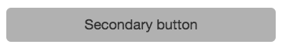

# UI guidelines for component's output

You are not required to use these style guidelines, but if you want your component to fit the overall style of Fliplet's components we recommend you use them.  

We always include Bootstrap, as the framework to build responsive interfaces, as a dependency in our component's, but you are not required to do the same, it's optional. (Learn more about dependencies [here](Dependencies-and-assets.md))

## Basic styles

Our component's output use the following basic styles:

Primary colour: `#337ab7`  
Secondary colour: `#d2d2d2`  
Text: `#333333`  

---

## Buttons

We use Bootstrap's button classes but we tweak the styles to make them look our own.  

**Primary button**


Primary button classes: `.btn.btn-primary`

We use some CSS to make the buttons look a bit different from Bootstrap's ones:

```css
.btn-primary {
	display: block;
	clear: both;
	width: 100%;
	padding: 10px 16px;
	font-size: 18px;
	line-height: 24px;
	border: none;
	text-align: center;
	cursor: pointer;
	border-radius: 6px;
	white-space: initial;
}

.btn-primary:focus,
.btn-primary:hover,
.btn:active:focus {
	outline: none;
}

@media (min-width:640px) {
	.btn-primary {
		clear: none;
		display: inline-block;
		width: auto;
		max-width: 100%;
	}
}
```

**Secondary button**



Secondary button classes: `.btn.btn-secondary`

We use some CSS to make the buttons look a bit different from Bootstrap's ones:

```css
.btn-secondary {
	display: block;
	clear: both;
	width: 100%;
	padding: 10px 16px;
	font-size: 18px;
	line-height: 24px;
	border: none;
	border-radius: 6px;
	text-align: center;
	cursor: pointer;
	background-color: #c0c0c0;
	white-space: initial;
}

.btn-secondary:focus,
.btn-secondary:hover,
.btn:active:focus {
	outline: none;
}

@media (min-width:640px) {
	.btn-secondary {
		clear: none;
		display: inline-block;
		width: auto;
		max-width: 100%;
	}
}
```

**Link text button**


Link text button classes: `.btn.btn-link`

```css
a,
.btn.btn-link {
    color: #337ab7;
    text-decoration: none;
}
```

---

## Loading animation


If you need to use a loading animation in you component's output here is how you can achieve it:

```html
<!-- Hidden loading animation -->
<div class="spinner-holder">
  <div class="spinner-overlay">Loading...</div>
</div>
```
```html
<!-- Show loading animation -->
<div class="spinner-holder animated">
  <div class="spinner-overlay">Loading...</div>
</div>
```

Use the following CSS to make it look like ours:

```css
.spinner-holder {
	overflow: hidden;
}

.spinner-overlay {
	display: none;
}

.spinner-holder.animated .spinner-overlay {
	display: block;
}

.spinner-overlay,
.spinner-overlay:after {
	border-radius: 50%;
	width: 10em;
	height: 10em;
}

.spinner-overlay {
	margin: 2px auto;
	font-size: 2px;
	position: relative;
	text-indent: -9999em;
	border-top: 1.1em solid rgba(138, 138, 138, 0.2);
	border-right: 1.1em solid rgba(138, 138, 138, 0.2);
	border-bottom: 1.1em solid rgba(138, 138, 138, 0.2);
	border-left: 1.1em solid #337ab7; /* color of the rotating section */
	-webkit-transform: translateZ(0);
	-ms-transform: translateZ(0);
	transform: translateZ(0);
	-webkit-animation: loadRotate 1.1s infinite linear;
	animation: loadRotate 1.1s infinite linear;
}
```

We use the following custom animation to make it spin:

```css
@-webkit-keyframes loadRotate {
	0% {
		-webkit-transform: rotate(0deg);
		transform: rotate(0deg);
	}

	100% {
		-webkit-transform: rotate(360deg);
		transform: rotate(360deg);
	}
}
@keyframes loadRotate {
	0% {
		-webkit-transform: rotate(0deg);
		transform: rotate(0deg);
	}

	100% {
		-webkit-transform: rotate(360deg);
		transform: rotate(360deg);
	}
}
```

---

[Read more on UI guidelines for component's interfaces](UI-guidelines-build.md)
{: .buttons}
