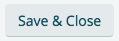
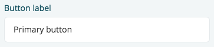
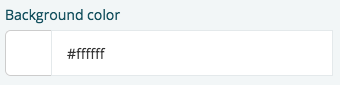
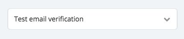
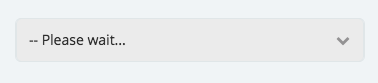
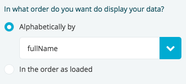
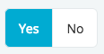
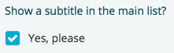
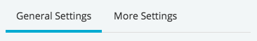

# UI guidelines for component interfaces

You are not required to use these style guidelines, but if you want your component to fit the overall style of Fliplet's components we recommend you use them.  

We always include Bootstrap as the framework to build responsive interfaces as part of the `fliplet-studio-ui` dependency. (Learn more about dependencies [here](Dependencies-and-assets.md))

## Basic styles

In the settings of our components we use the following basic styles:

Primary colour: `#00abd2`  
Secondary colour: `#aaaaaa`  
Text: `#333333`  
Headings:
```html
<h2><small>Heading</small></h2>
```
Helper text class: `.text-helper`

---

## Buttons

We use Bootstrap's button classes but we tweak the styles to make them look our own.  

**Primary button**


Primary button classes: `.btn.btn-primary`


**Secondary button**



Secondary button classes: `.btn.btn-default`

**Danger button**


Danger button classes: `.btn.btn-danger`

**Link text button**


Link text button classes: `.btn.btn-link`

---

## Component's header

We always start with a small header for the component that is always visible at the top.  
Here is an example:

```html
<header>
  <p>Configure your Primary button</p>
  <a id="help_tip" href="#">Need help?</a>
</header>
```

---

## Component's form fields

In our components we use the following form fields:
- [Input field](#input-field)
- [Colour picker](#colour-picker)
- [Drop-down list](#drop-down-list)
- [Radio buttons](#radio-buttons)
- [Checkboxes](#checkboxes)

### Input field



As we use Bootstrap, this is how our input fields markup with a label look like:

```html
<div class="form-group clearfix">
  <div class="col-sm-4 control-label">
    <label for="input_field">Input label</label>
  </div>
  <div class="col-sm-8">
    <input type="text" name="input_field" class="form-control" id="input_field" placeholder="Placeholder" value=""/>
  </div>
</div>
```

If you want to use an input field without a label, all you need to do is remove the label `<div>` and your markup should look like this:

```html
<div class="form-group clearfix">
  <div class="col-sm-8">
    <input type="text" name="input_field" class="form-control" id="input_field" placeholder="Placeholder" value=""/>
  </div>
</div>
```

### Colour picker



For colour pickers we use Bootstrap's input field with an addon.  
Here is an example:

```html
<div class="form-group">
  <div class="col-sm-4 control-label">
    <label>Pick a color</label>
  </div>
  <div class="col-sm-8">
    <div class="input-group">
      <div class="input-group-addon" style="background-color:#00abd2">&nbsp;&nbsp;&nbsp;</div>
      <input type="text" class="form-control" value="#00abd2">
    </div>
  </div>
</div>
```

If you want to use an input field without a label, all you need to do is remove the label `<div>` and your markup should look like this:

```html
<div class="form-group clearfix">
  <div class="col-sm-8">
    <div class="input-group">
      <div class="input-group-addon" style="background-color:#00abd2">&nbsp;&nbsp;&nbsp;</div>
      <input type="text" class="form-control" value="#00abd2">
    </div>
  </div>
</div>
```

### Drop-down list



HTML Select aren't easy to style, some HTML and CSS magic needs to be applied. If you want yours to look like ours do the following:

```html
<div class="form-group clearfix">
  <div class="col-sm-4 control-label">
    <label>An awesome drop-down list</label>
  </div>
  <div class="col-sm-8">
    <label for="drop-down" class="select-proxy-display">
      <span class="icon fa fa-chevron-down"></span>
      <span class="select-value-proxy">-- Select an option</span>
      <select id="drop-down" data-label="select" class="hidden-select form-control">
        <option value="">-- Select an option</option>
        <option value="1">Option 1</option>
        <option value="2">Option 2</option>
      </select>
    </label>
  </div>
</div>
```

The trick here is to hide the `<select>` and use a `<label>` to look like a drop-down. We trigger the drop-down using the `for` attribute in the label that matches the `<select>` `id` attribute.  
We will then use some JavaScript to update the `span.select-value-proxy` text to match the text of the option selected in the drop-down list.

You don't need to worry about the JavaScript bit as it is part of our system.

**Dynamically appending options**

If you are using one of these drop-downs with dynamic data to create the `<option>` then we recommend start the `<select>` disabled by adding the `disable` attribute to it, also remove all the `<option>` and in the `span.select-value-proxy` default it to _"-- Please wait..."_.  
Here is the markup for it:

```html
<div class="form-group clearfix">
  <div class="col-sm-4 control-label">
    <label>An awesome drop-down list</label>
  </div>
  <div class="col-sm-8">
    <label for="drop-down" class="select-proxy-display">
      <span class="icon fa fa-chevron-down"></span>
      <span class="select-value-proxy">-- Please wait...</span>
      <select id="drop-down" data-label="select" class="hidden-select form-control" disabled></select>
    </label>
  </div>
</div>
```



Then in the JavaScript after you add the dynamic `<option>` you need to remove the `disabled` attribute and trigger a change.  
Here is an example where we append the column names of a Data Source:

```js
Fliplet.DataSources.getById(dataSourceId).then(function (dataSource) {
  $('#drop-down').html('<option value="">-- Select a column</option>');

  dataSource.columns.forEach(function (c) {
    $('#drop-down').append('<option value="' + c + '">' + c + '</option>');
  });

  // When loading the saved data
  if (data.columnName) {
    $('#drop-down').val(data.columnName);
  }

  // Trigger a change to update the .select-value-proxy text
  $('#drop-down').trigger('change');

  // Removes disabled attribute to allow the user to use the drop-down
  $('#drop-down').prop('disabled', '');
});
```

### Radio buttons

For radio buttons we have two different styles depending on what we want to achieve.  
- If we want to achieve a list of more than 3 options that might also have sub-settings under each option - We would use the more traditional style.  
If we want to achieve a toggle look with 3 or less options - We would use a button like style.

**Traditional style**



Here is the markup to achieve the traditional style with our branding:

```html
<div class="form-group clearfix">
  <div class="col-sm-4 control-label">
    <label>In what order do you want do display your data?</label>
  </div>
  <div class="col-sm-8">
    <div class="radio">
      <input type="radio" id="alphabetical" name="is_alphabetical" value="true" checked>
      <label for="alphabetical">
        <span class="check"><i class="fa fa-circle"></i></span> Alphabetically
      </label>
    </div>
    <div class="radio">
      <input type="radio" id="order" name="is_alphabetical" value="false">
      <label for="order">
        <span class="check"><i class="fa fa-circle"></i></span> In the order as loaded
      </label>
    </div>
  </div>
</div>
```

**Button like style**



Here is the markup to achieve the button like style with our branding:

```html
<div class="form-group clearfix inline-radio">
  <div class="col-sm-4 control-label">
    <label for="swipe-to-save">Enable this awesome option?</label>
  </div>
  <div class="col-sm-8">
    <div class="radio-buttons clearfix">
      <div class="radio">
        <input type="radio" id="enable-yes" name="enable_option" value="show">
        <label for="enable-yes">Yes</label>
      </div>
      <div class="radio">
        <input type="radio" id="enable-no" name="enable_option" value="no-show">
        <label for="enable-no">No</label>
      </div>
    </div>
  </div>
</div>
```

In both cases we hide the radio input field and we style the label to look like what we want. The trick is again to use the `<label>` `for` attribute to trigger the radio input.

### Checkboxes



Here is the markup to achieve the checkboxes with our branding:

```html
<div class="form-group clearfix">
  <div class="col-sm-4 control-label">
    <label for="show_subtitle">Show a subtitle in the main list?</label>
  </div>
  <div class="col-sm-8">
    <div class="checkbox">
      <input type="checkbox" id="show_subtitle">
      <label for="show_subtitle">
        <span class="check"><i class="fa fa-check"></i></span> Yes, please
      </label>
    </div>
  </div>
</div>
```

We hide the checkbox input field and we style the label to look like what we want. The trick is again to use the `<label>` `for` attribute to trigger the checkbox input.

## Tabs



If you need to categorise your component's settings then you should use our tabbed system.  
Again, we use Bootstrap's tabbed system and we style it to look like we want it.

Here is a quick example of the markup:

```html
<ul class="nav nav-tabs" role="tablist">
  <li role="presentation" class="active" id="general-settings"><a href="#settings-tab" aria-controls="general-settings" role="tab" data-toggle="tab">General Settings</a></li>
  <li role="presentation" class="" id="more-settings"><a href="#more-settings-tab" aria-controls="more-settings" role="tab" data-toggle="tab">More Settings</a></li>
</ul>

<div class="tab-content">
  <div role="tabpanel" class="tab-pane active" id="settings-tab">
    <!-- Content here -->
  </div>
  <div role="tabpanel" class="tab-pane" id="more-settings-tab">
    <!-- Content here -->
  </div>
</div>
```
