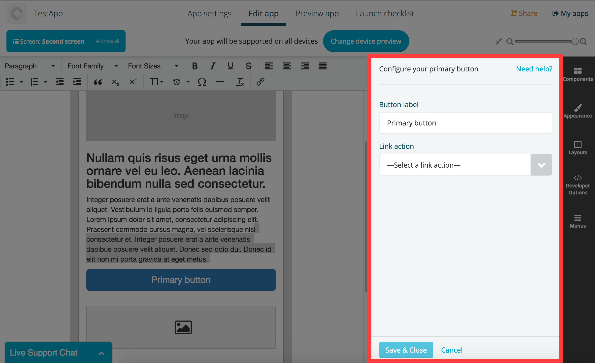

# Components interfaces

Components usually define interfaces to let ther instances **save settings**.

A quick example is the interface of the [button component](https://github.com/Fliplet/fliplet-widget-primary-button) to let you specify the button label and the action to be fired or page to view once tapped:



In the above example, the [button component](https://github.com/Fliplet/fliplet-widget-primary-button) is also using the [link provider](https://github.com/Fliplet/fliplet-widget-link) to select an action for the button.

Both page components and app components can have an interface, although it is not required.

## The template (interface.html)

The interface consists in a html template which gets parsed and compiled via [Handlebars](http://handlebarsjs.com/), plus any other asset (like CSS and JS files, though they don't get compiled).

Your template will get available in the view all settings that have been previously saved in the instance as handlebars variables. You can also print the component unique id using the `{{ id }}` variable.

Example:


```handlebars
<p>{{ foo }}</p>

{{#if url}}
  <video src="{{ url }}" data-my-component-id="{{ id }}"></video>
{{/if}}
```


## Saving the settings

Saving an instance settings is done using the public method `Fliplet.Widget.save` found in the `fliplet-core` package:

```js
// Returns a promise
Fliplet.Widget.save({
  foo: 'bar',
  url: 'funny-cats.mp4,
  hello: {
    world: true
  }
});
```

## Reading previously saved settings

Your component interface can be reopened if the component output is clicked via the screen preview by the Fliplet Studio user. Once the interface is reopened, you're responsible for reading the previously saved settings and repopulate your interface.

Data for the interface can be retrieved using the `Fliplet.Widget.getData` method from `fliplet-core` as follows:

```js
var data = Fliplet.Widget.getData();

// data.foo is 'bar'
```

## UI design

Although it isn't required, we recommend using our design patterns and styles when developing components. We have made a nice package called `fliplet-studio-ui` which contains most of the styles we use on our interfaces.

Here's a sample of the interface for the button component:


```handlebars
<div>
  <form class="form-horizontal">
    <header>
      <p>Configure your primary button</p>
      <a id="help_tip" href="#">Need help?</a>
    </header>

    <div class="form-group clearfix">
      <div class="col-sm-4 control-label">
        <label for="primaryButtonLabel">Button label</label>
      </div>
      <div class="col-sm-8">
        <input type="text" name="name" class="form-control" id="primaryButtonLabel" placeholder="Label" value="{{#if label}}{{label}}{{else}}Primary button{{/if}}" required />
      </div>
    </div>

  </form>
</div>
```


### Referencing assets on interface.html


```handlebars

```


[Read more on UI Guidelines](../UI-guidelines-interface.md)
{: .buttons}

---

## Including providers

Components can include other components (if marked as providers) to add more functionalities or gather data from different sources.

[Read more on using providers](Using-Providers.md)
{: .buttons}

---

## Output of components

Once you're familiar with the above documentation on the component interface, have a read to the next section which covers the output of components.

[Next: output of components (build.html)](Build-output.md)
{: .buttons}
