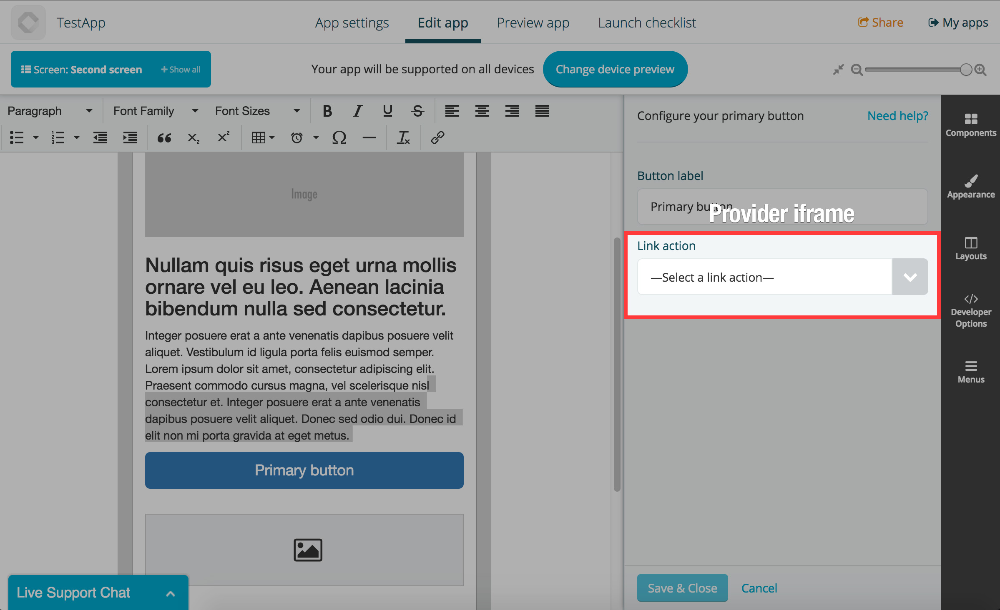

# Using providers

Components can display providers to get specific data from the system or need a particular piece of functionality to be added.

The easiest example is the [button component](https://github.com/Fliplet/fliplet-widget-primary-button), which uses the [link provider](../API/providers/link-action.html) to configure the action of the button.

You can find a list of commonly used providers below:

- [Link action provider](../API/providers/link-action.html) - Choose an action to be performed
- [Data source provider](../API/providers/data-source.html) - Choose a data source
- [File picker](../API/providers/file-picker.html) - Choose one or multiple files and folders
- [Email provider](../API/providers/email.html) - Configure an email




## Usage

```js
var provider = Fliplet.Widget.open('com.fliplet.link', {
  selector: '#provider-container',
  data: { foo: 'bar' },
  onEvent: function(event, payload) {
    switch (event) {
      case 'foo':
        break;
      case 'bar':
        break;
      default:
        break;
    }
  }
}).then(function(result) {
  console.log('Provider saved:', result);
});
```

## Parameters

```js
Fliplet.Widget.open(package, options)
```

* `package` (String) **Required** Package name for the provider.
* `options` (Object) A map of options for initiating the provider.
  * `selector` (String) Add a selector string to initialize the provider iFrame within the target. If it's not provided, the provider will be rendered in full-screen mode.
  * `data` (Object) Data to be provided to the provider.
  * `onEvent` (Function(`event`, `payload`)) A function for listening to events fired from the provider.
  * `closeOnSave` (Boolean) Set to `false` to stop the provider from closing when saved. You can use the `close()` method to manually close the provider. **Default**: `true`

## Return value

The `Fliplet.Widget.open()` function returns a Provider object, which is Promise-like. The Provider object has the following methods.

### `then(Function)`

Callback function for when the provider is saved.

**Example**

```js
provider.then(function(result) {
  console.log('Provider saved:', result);
});
```

### `forwardSaveRequest()`

Trigger the provider to start saving data

**Example**

```js
provider.forwardSaveRequest();
```

### `provider.emit(event, payload)`

Emit a trigger event to the provider.

**Parameters**

* `event` (String) **Required** Event name to be triggered.
* `payload` (*) Payload for the trigger.

**Example**

```js
provider.emit('set-data', { foo: 'bar' });
```

### `provider.close()`

Close the provider.

**Example**

```js
provider.close();
```

## Resolving multiple providers

```js
// You can also resolve an array of providers (similar to Promise.all)
Fliplet.Widget.all([myProviderA, myProviderB, myProviderC]).then(function (results) {
  // results is an array with data from all the providers resolved
});
```

---

[Back to the interface of components](Interface.md)
{: .buttons}
